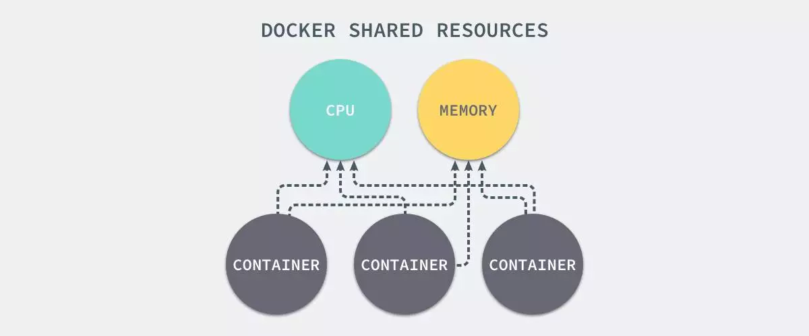
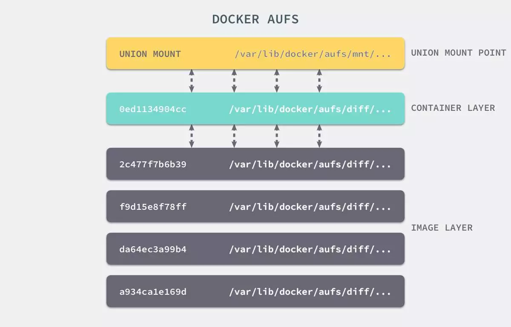

#### 实现原理

docker优势：

- 轻量级的虚拟化

- 容器快速启停

  

虚拟化核心需要解决的问题：资源隔离与资源限制

- 虚拟机硬件虚拟化技术， 通过一个 hypervisor 层实现对资源的彻底隔离。
- 容器则是操作系统级别的虚拟化，利用的是内核的 Cgroup 和 Namespace 特性，此功能完全通过软件实现。

###### Namespace 资源隔离

命名空间是全局资源的一种抽象，将资源放到不同的命名空间中，各个命名空间中的资源是相互隔离的。 

| **分类**           | **系统调用参数** | **相关内核版本**                                             |
| ------------------ | ---------------- | ------------------------------------------------------------ |
| Mount namespaces   | CLONE_NEWNS      | [Linux 2.4.19](http://lwn.net/2001/0301/a/namespaces.php3)   |
| UTS namespaces     | CLONE_NEWUTS     | [Linux 2.6.19](http://lwn.net/Articles/179345/)              |
| IPC namespaces     | CLONE_NEWIPC     | [Linux 2.6.19](http://lwn.net/Articles/187274/)              |
| PID namespaces     | CLONE_NEWPID     | [Linux 2.6.24](http://lwn.net/Articles/259217/)              |
| Network namespaces | CLONE_NEWNET     | [始于Linux 2.6.24 完成于 Linux 2.6.29](http://lwn.net/Articles/219794/) |
| User namespaces    | CLONE_NEWUSER    | [始于 Linux 2.6.23 完成于 Linux 3.8](http://lwn.net/Articles/528078/) |

我们知道，docker容器对于操作系统来讲其实是一个进程，我们可以通过原始的方式来模拟一下容器实现资源隔离的基本原理：

linux系统中，通常可以通过`clone()`实现进程创建的系统调用 ，原型如下：

```c
int clone(int (*child_func)(void *), void *child_stack, int flags, void *arg);

```

- **child_func** : 传入子进程运行的程序主函数。
- **child_stack** : 传入子进程使用的栈空间。
- **flags** : 表示使用哪些 `CLONE_*` 标志位。
- **args** : 用于传入用户参数。

示例一：实现进程独立的UTS空间

```c
#define _GNU_SOURCE
#include <sys/mount.h> 
#include <sys/types.h>
#include <sys/wait.h>
#include <stdio.h>
#include <sched.h>
#include <signal.h>
#include <unistd.h>
#define STACK_SIZE (1024 * 1024)
static char container_stack[STACK_SIZE];
char* const container_args[] = {
  "/bin/bash",
  NULL
};

int container_main(void* arg)
{
  printf("Container - inside the container!\n");
  sethostname("container",10); /* 设置hostname */
  execv(container_args[0], container_args);
  printf("Something's wrong!\n");
  return 1;
}

int main()
{
  printf("Parent - start a container!\n");
  int container_pid = clone(container_main, container_stack+STACK_SIZE, CLONE_NEWUTS | SIGCHLD , NULL);
  waitpid(container_pid, NULL, 0);
  printf("Parent - container stopped!\n");
  return 0;
}

```

执行编译并测试：

```bash
$ gcc -o ns_uts ns_uts.c
$ ./ns_uts
$ hostname

```

示例二：实现容器独立的进程空间

```c
#define _GNU_SOURCE
#include <sys/mount.h> 
#include <sys/types.h>
#include <sys/wait.h>
#include <stdio.h>
#include <sched.h>
#include <signal.h>
#include <unistd.h>
#define STACK_SIZE (1024 * 1024)
static char container_stack[STACK_SIZE];
char* const container_args[] = {
  "/bin/bash",
  NULL
};

int container_main(void* arg)
{
  printf("Container [%5d] - inside the container!\n", getpid());
  sethostname("container",10); /* 设置hostname */
  execv(container_args[0], container_args);
  printf("Something's wrong!\n");
  return 1;
}

int main()
{
  printf("Parent [%5d] - start a container!\n", getpid());
  int container_pid = clone(container_main, container_stack+STACK_SIZE, CLONE_NEWUTS | CLONE_NEWPID | SIGCHLD , NULL);
  waitpid(container_pid, NULL, 0);
  printf("Parent - container stopped!\n");
  return 0;
}

```

执行编译并测试：

```bash
$ gcc -o ns_pid ns_pid.c
$ ./ns_pid
$ echo $$

```

如何确定进程是否属于同一个namespace：

```bash
$ ./ns_pid
Parent [ 8061] - start a container!
$ pstree -p 8061
pid1(8061)───bash(8062)───pstree(8816)
$ ls -l /proc/8061/ns
lrwxrwxrwx 1 root root 0 Jun 24 12:51 ipc -> ipc:[4026531839]
lrwxrwxrwx 1 root root 0 Jun 24 12:51 mnt -> mnt:[4026531840]
lrwxrwxrwx 1 root root 0 Jun 24 12:51 net -> net:[4026531968]
lrwxrwxrwx 1 root root 0 Jun 24 12:51 pid -> pid:[4026531836]
lrwxrwxrwx 1 root root 0 Jun 24 12:51 user -> user:[4026531837]
lrwxrwxrwx 1 root root 0 Jun 24 12:51 uts -> uts:[4026531838]
$ ls -l /proc/8062/ns
lrwxrwxrwx 1 root root 0 Jun 24 12:51 ipc -> ipc:[4026531839]
lrwxrwxrwx 1 root root 0 Jun 24 12:51 mnt -> mnt:[4026531840]
lrwxrwxrwx 1 root root 0 Jun 24 12:51 net -> net:[4026531968]
lrwxrwxrwx 1 root root 0 Jun 24 12:51 pid -> pid:[4026534845]
lrwxrwxrwx 1 root root 0 Jun 24 12:51 user -> user:[4026531837]
lrwxrwxrwx 1 root root 0 Jun 24 12:51 uts -> uts:[4026534844]

## 发现pid和uts是和父进程使用了不同的ns，其他的则是继承了父进程的命名空间

```


综上：通俗来讲，docker在启动一个容器的时候，会调用Linux Kernel Namespace的接口，来创建一块虚拟空间，创建的时候，可以支持设置下面这几种（可以随意选择）,docker默认都设置。

- pid：用于进程隔离（PID：进程ID）
- net：管理网络接口（NET：网络）
- ipc：管理对 IPC 资源的访问（IPC：进程间通信（信号量、消息队列和共享内存））
- mnt：管理文件系统挂载点（MNT：挂载）
- uts：隔离主机名和域名
- user：隔离用户和用户组

###### CGroup 资源限制

通过namespace可以保证容器之间的隔离，但是无法控制每个容器可以占用多少资源， 如果其中的某一个容器正在执行 CPU 密集型的任务，那么就会影响其他容器中任务的性能与执行效率，导致多个容器相互影响并且抢占资源。如何对多个容器的资源使用进行限制就成了解决进程虚拟资源隔离之后的主要问题。



Control Groups（简称 CGroups）

> cgroups是Linux内核提供的一种机制，这种机制可以根据需求吧一系列系统任务及其子任务整合(或分隔)到按资源划分等级的不同组中，从而为系统资源管理提供一个统一的框架。

CGroups能够隔离宿主机器上的物理资源，例如 CPU、内存、磁盘 I/O 。每一个 CGroup 都是一组被相同的标准和参数限制的进程。而我们需要做的，其实就是把容器这个进程加入到指定的Cgroup中。深入理解CGroup，请[点此]()。

###### UnionFS 联合文件系统

Linux namespace和cgroup分别解决了容器的资源隔离与资源限制，那么容器是很轻量的，通常每台机器中可以运行几十上百个容器， 这些个容器是共用一个image，还是各自将这个image复制了一份，然后各自独立运行呢？ 如果每个容器之间都是全量的文件系统拷贝，那么会导致至少如下问题：

- 运行容器的速度会变慢
- 容器和镜像对宿主机的磁盘空间的压力

怎么解决这个问题------Docker的存储驱动

- 镜像分层存储 + 写时复制
- UnionFS

Docker 镜像是由一系列的层组成的，每层代表 Dockerfile 中的一条指令，比如下面的 Dockerfile 文件：

```dockerfile
FROM ubuntu:15.04
COPY . /app
RUN make /app
CMD python /app/app.py

```

这里的 Dockerfile 包含4条命令，其中每一行就创建了一层，下面显示了上述Dockerfile构建出来的镜像运行的容器层的结构：


镜像就是由这些层一层一层堆叠起来的，镜像中的这些层都是只读的，当我们运行容器的时候，就可以在这些基础层至上添加新的可写层，也就是我们通常说的`容器层`，对于运行中的容器所做的所有更改（比如写入新文件、修改现有文件、删除文件）都将写入这个容器层。

对容器层的操作，主要利用了写时复制（CoW）技术。CoW就是copy-on-write，表示只在需要写时才去复制，这个是针对已有文件的修改场景。 CoW技术可以让所有的容器共享image的文件系统，所有数据都从image中读取，只有当要对文件进行写操作时，才从image里把要写的文件复制到自己的文件系统进行修改。所以无论有多少个容器共享同一个image，所做的写操作都是对从image中复制到自己的文件系统中的复本上进行，并不会修改image的源文件，且多个容器操作同一个文件，会在每个容器的文件系统里生成一个复本，每个容器修改的都是自己的复本，相互隔离，相互不影响。使用CoW可以有效的提高磁盘的利用率。 


**镜像中每一层的文件都是分散在不同的目录中的，如何把这些不同目录的文件整合到一起呢？**

UnionFS 其实是一种为 Linux 操作系统设计的用于把多个文件系统联合到同一个挂载点的文件系统服务。  它能够将不同文件夹中的层联合（Union）到了同一个文件夹中，整个联合的过程被称为联合挂载（Union Mount）。



上图是AUFS的实现，AUFS是作为Docker存储驱动的一种实现，Docker 还支持了不同的存储驱动，包括 aufs、devicemapper、overlay2、zfs 和  Btrfs 等等，在最新的 Docker 中，overlay2 取代了 aufs 成为了推荐的存储驱动，但是在没有 overlay2 驱动的机器上仍然会使用 aufs 作为 Docker 的默认驱动。 

#### 