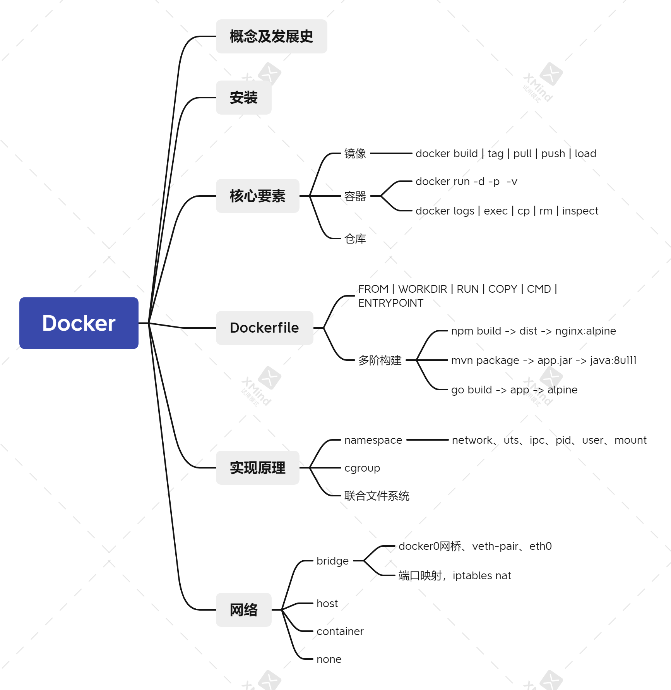

#### 实用技巧

1. 清理主机上所有退出的容器

   ```bash
   $ docker rm  $(docker ps -aq)
   ```

2. 调试或者排查容器启动错误

   ```bash
   ## 若有时遇到容器启动失败的情况，可以先使用相同的镜像启动一个临时容器，先进入容器
   $ docker run --rm -ti <image_id> sh
   ## 进入容器后，手动执行该容器对应的ENTRYPOINT或者CMD命令，这样即使出错，容器也不会退出，因为bash作为1号进程，我们只要不退出容器，该容器就不会自动退出
   ```


#### 本章小结



1. 为了解决软件交付过程中的环境依赖，同时提供一种更加轻量的虚拟化技术，Docker出现了。
2. 2013年诞生，15年开始迅速发展，从17.03月开始，使用时间日期管理版本，稳定版以每季度为准。
3. Docker是一种CS架构的软件产品，可以把代码及依赖打包成镜像，作为交付介质，并且把镜像启动成为容器，提供容器生命周期的管理。
4. 使用yum部署docker，启动后通过操作docker这个命令行，自动调用docker daemon完成容器相关操作。
5. 常用操作，围绕`镜像|容器|仓库`三大核心要素

   - systemctl  start|stop|restart docker
   - docker build | pull  -> docker tag -> docker push
   - docker run --name my-demo  -d  -p 8080:80 -v  /opt/data:/data  demo:v20200327 ping xx.com
   - docker cp  /path/a.txt  mycontainer:/opt
   - docker exec -ti  mycontainer  /bin/sh
   - docker logs -f --tail=100 mycontainer
6. 通过dockerfile构建业务镜像，先使用基础镜像，然后通过一系列的指令把我们的业务应用所需要的运行环境和依赖都打包到镜像中，然后通过CMD或者ENTRYPOINT指令把镜像启动时的入口制定好，完成封装即可。有点类似于，先找来一个集装箱模板(基础镜像)，然后把项目依赖的服务都扔到集装箱中，然后设置好服务的启动入口，关闭箱门，即完成了业务镜像的制作。
7. 容器的实现依赖于内核模块提供的namespace和control-group的功能，通过namespace创建一块虚拟空间，空间内实现了各类资源(进程、网络、文件系统)的隔离，提供control-group实现了对隔离的空间的资源使用的限制。
8. docker镜像使用分层的方式进行存储，根据主机的存储驱动的不同，实现方式会不同，kernel在3.10.0-514以上自动支持overlay2 存储驱动，也是目前Docker推荐的方式。
9. 得益于分层存储的模式，多个容器可以通过copy-on-write的策略，在镜像的最上层加一个可写层，同时利用存储驱动的UnionFS的能力，实现一个镜像快速启动多个容器的场景。
10. docker的网络模式分为4种，最常用的为bridge和host模式。bridge模式通过docker0网桥，启动容器的时候通过创建一对虚拟网卡，将容器连接在桥上，同时维护了虚拟网卡与网桥端口的关系，实现容器间的通信。容器与宿主机之间的通信通过iptables端口映射的方式，docker利用iptables的PREROUTING和POSTROUTING的nat功能，实现了SNAT与DNAT，使得容器内部的服务被完美的保护起来。
11. 本章重点内容是docker的核心要素及基础的操作，实现原理以及docker的网络模式为选修包，目的为了帮助有docker基础及经验的同学更好的进一步理解docker。