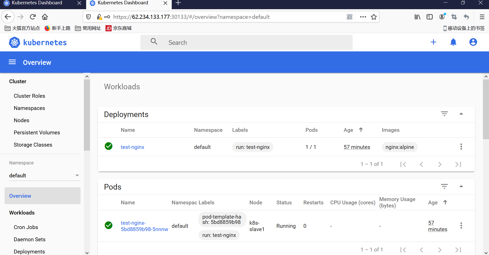

### 部署dashboard

- 部署服务

```bash
# 推荐使用下面这种方式
$ wget https://raw.githubusercontent.com/kubernetes/dashboard/v2.2.0/aio/deploy/recommended.yaml
$ vi recommended.yaml
# 修改Service为NodePort类型，文件的45行上下
......
kind: Service
apiVersion: v1
metadata:
  labels:
    k8s-app: kubernetes-dashboard
  name: kubernetes-dashboard
  namespace: kubernetes-dashboard
spec:
  ports:
    - port: 443
      targetPort: 8443
  selector:
    k8s-app: kubernetes-dashboard
  type: NodePort  # 加上type=NodePort变成NodePort类型的服务
......
```

- 查看访问地址，本例为30133端口

```bash
$ kubectl apply -f recommended.yaml
$ kubectl -n kubernetes-dashboard get svc
NAME                        TYPE        CLUSTER-IP      EXTERNAL-IP   PORT(S)         AGE
dashboard-metrics-scraper   ClusterIP   10.105.62.124   <none>        8000/TCP        31m
kubernetes-dashboard        NodePort    10.103.74.46    <none>        443:30133/TCP   31m 
```

- 使用浏览器访问 https://172.21.51.67:30133，其中172.21.51.67为master节点的外网ip地址，chrome目前由于安全限制，测试访问不了，使用firefox可以进行访问。

- 创建ServiceAccount进行访问

```bash
$ vi dashboard-admin.conf
kind: ClusterRoleBinding
apiVersion: rbac.authorization.k8s.io/v1
metadata:
  name: admin
  annotations:
    rbac.authorization.kubernetes.io/autoupdate: "true"
roleRef:
  kind: ClusterRole
  name: cluster-admin
  apiGroup: rbac.authorization.k8s.io
subjects:
- kind: ServiceAccount
  name: admin
  namespace: kubernetes-dashboard

---
apiVersion: v1
kind: ServiceAccount
metadata:
  name: admin
  namespace: kubernetes-dashboard

$ kubectl apply -f dashboard-admin.conf
$ kubectl -n kubernetes-dashboard get secret |grep admin-token
admin-token-fqdpf                  kubernetes.io/service-account-token   3      7m17s
# 使用该命令拿到token，然后粘贴到
$ kubectl -n kubernetes-dashboard get secret admin-token-fqdpf -o jsonpath={.data.token}|base64 -d
eyJhbGciOiJSUzI1NiIsImtpZCI6Ik1rb2xHWHMwbWFPMjJaRzhleGRqaExnVi1BLVNRc2txaEhETmVpRzlDeDQifQ.eyJpc3MiOiJrdWJlcm5ldGVzL3NlcnZpY2VhY2NvdW50Iiwia3ViZXJuZXRlcy5pby9zZXJ2aWNlYWNjb3VudC9uYW1lc3BhY2UiOiJrdWJlcm5ldGVzLWRhc2hib2FyZCIsImt1YmVybmV0ZXMuaW8vc2VydmljZWFjY291bnQvc2VjcmV0Lm5hbWUiOiJhZG1pbi10b2tlbi1mcWRwZiIsImt1YmVybmV0ZXMuaW8vc2VydmljZWFjY291bnQvc2VydmljZS1hY2NvdW50Lm5hbWUiOiJhZG1pbiIsImt1YmVybmV0ZXMuaW8vc2VydmljZWFjY291bnQvc2VydmljZS1hY2NvdW50LnVpZCI6IjYyNWMxNjJlLTQ1ZG...

```




