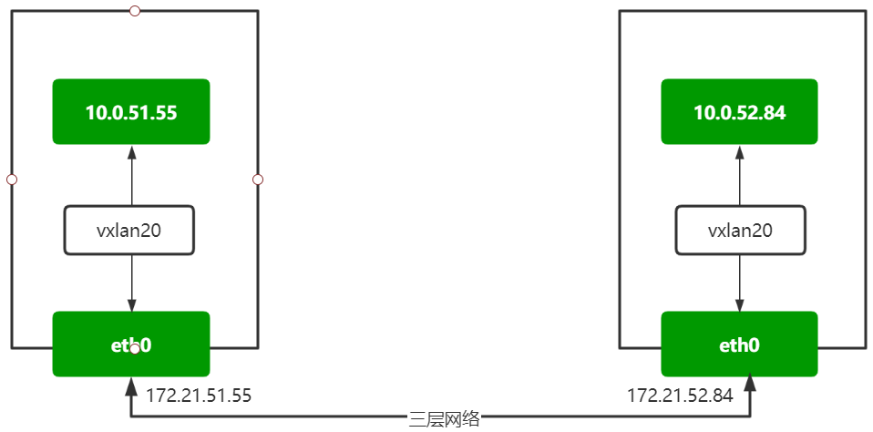
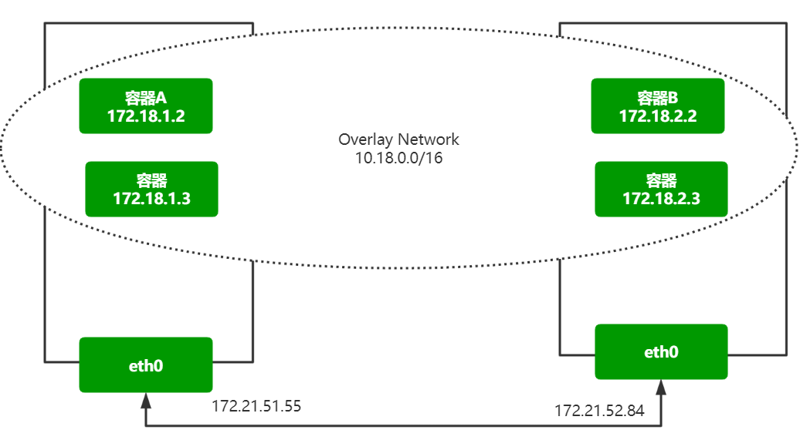
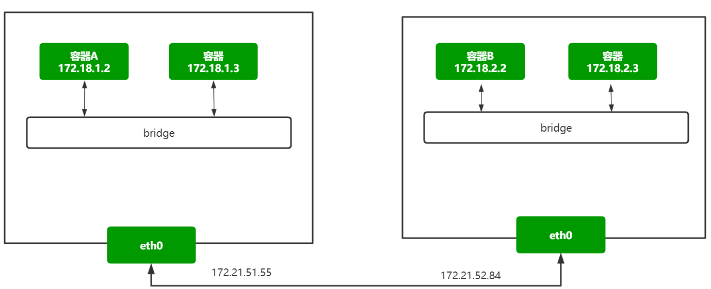
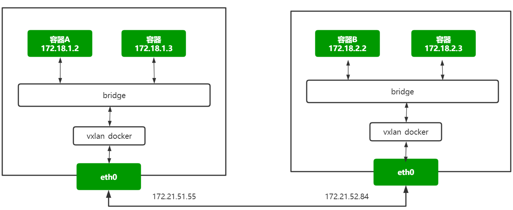
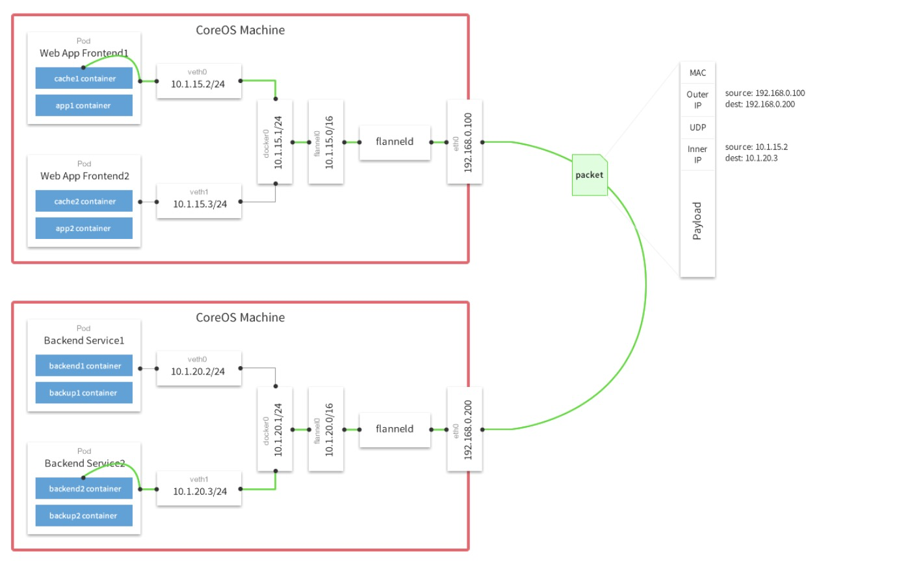
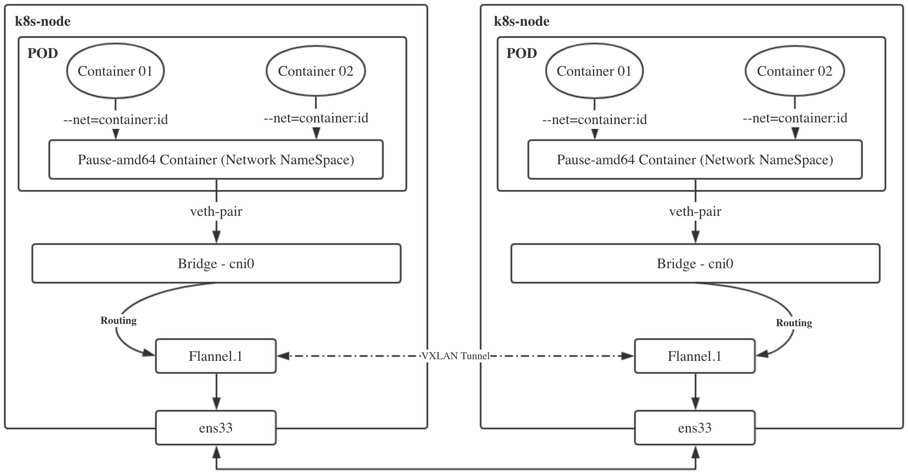
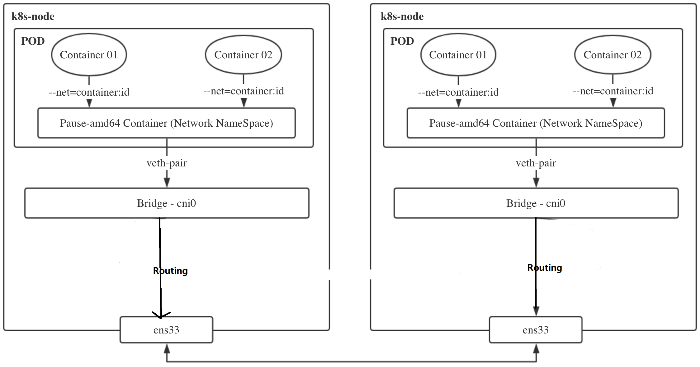

#### Kubernetes集群的网络实现

##### CNI介绍及集群网络选型

容器网络接口（Container Network Interface），实现kubernetes集群的Pod网络通信及管理。包括：

- CNI Plugin负责给容器配置网络，它包括两个基本的接口：
  配置网络: AddNetwork(net NetworkConfig, rt RuntimeConf) (types.Result, error)
  清理网络: DelNetwork(net NetworkConfig, rt RuntimeConf) error
- IPAM Plugin负责给容器分配IP地址，主要实现包括host-local和dhcp。

以上两种插件的支持，使得k8s的网络可以支持各式各样的管理模式，当前在业界也出现了大量的支持方案，其中比较流行的比如flannel、calico等。

kubernetes配置了cni网络插件后，其容器网络创建流程为：

- kubelet先创建pause容器生成对应的network namespace
- 调用网络driver，因为配置的是CNI，所以会调用CNI相关代码，识别CNI的配置目录为/etc/cni/net.d
- CNI driver根据配置调用具体的CNI插件，二进制调用，可执行文件目录为/opt/cni/bin,[项目](https://github.com/containernetworking/plugins)
- CNI插件给pause容器配置正确的网络，pod中其他的容器都是用pause的网络

 可以在此查看社区中的CNI实现，https://github.com/containernetworking/cni 

通用类型：flannel、calico等，部署使用简单

其他：根据具体的网络环境及网络需求选择，比如

- 公有云机器，可以选择厂商与网络插件的定制Backend，如AWS、阿里、腾讯针对flannel均有自己的插件，也有AWS ECS CNI
- 私有云厂商，比如Vmware NSX-T等
- 网络性能等，MacVlan

##### Flannel网络模型实现剖析

flannel的网络有多种实现：

- udp
- vxlan
- host-gw
- ...

不特殊指定的话，默认会使用vxlan技术作为Backend，可以通过如下查看：

```bash
$ kubectl -n kube-system exec  kube-flannel-ds-amd64-cb7hs cat /etc/kube-flannel/net-conf.json
{
  "Network": "10.244.0.0/16",
  "Backend": {
    "Type": "vxlan"
  }
}

```

###### vxlan介绍及点对点通信的实现

VXLAN 全称是虚拟可扩展的局域网（ Virtual eXtensible Local Area Network），它是一种 overlay 技术，通过三层的网络来搭建虚拟的二层网络。


它创建在原来的 IP 网络（三层）上，只要是三层可达（能够通过 IP 互相通信）的网络就能部署 vxlan。在每个端点上都有一个 vtep 负责 vxlan 协议报文的封包和解包，也就是在虚拟报文上封装 vtep 通信的报文头部。物理网络上可以创建多个 vxlan 网络，这些 vxlan 网络可以认为是一个隧道，不同节点的虚拟机能够通过隧道直连。每个 vxlan 网络由唯一的 VNI 标识，不同的 vxlan 可以不相互影响。 

- VTEP（VXLAN Tunnel Endpoints）：vxlan 网络的边缘设备，用来进行 vxlan 报文的处理（封包和解包）。vtep 可以是网络设备（比如交换机），也可以是一台机器（比如虚拟化集群中的宿主机）
- VNI（VXLAN Network Identifier）：VNI 是每个 vxlan 的标识，一共有 2^24 = 16,777,216，一般每个 VNI 对应一个租户，也就是说使用 vxlan 搭建的公有云可以理论上可以支撑千万级别的租户

演示：在k8s-slave1和k8s-slave2两台机器间，利用vxlan的点对点能力，实现虚拟二层网络的通信



`172.21.51.55`节点：

```bash
# 创建vTEP设备，对端指向172.21.52.84节点，指定VNI及underlay网络使用的网卡
$ ip link add vxlan20 type vxlan id 20 remote 172.21.52.84 dstport 4789 dev eth0

$ ip -d link show vxlan20

# 启动设备
$ ip link set vxlan20 up 

# 设置ip地址
$ ip addr add 10.0.51.55/24 dev vxlan20

```


`172.21.52.84`节点：

```bash
# 创建VTEP设备，对端指向k8s-slave1节点，指定VNI及underlay网络使用的网卡
$ ip link add vxlan20 type vxlan id 20 remote 172.21.51.55 dstport 4789 dev eth0

# 启动设备
$ ip link set vxlan20 up 

# 设置ip地址
$ ip addr add 10.0.52.84/24 dev vxlan20

```


在`172.21.51.55`节点：

```bash
$ ping 10.0.52.84

# 走vtep封包解包

$ ip route add 10.0.52.0/24 dev vxlan20

# 在172.21.52.84机器
$ ip route add 10.0.51.0/24 dev vxlan20

# 再次ping
$ ping 10.0.52.84

# 
$ tcpdump -i vxlan20 icmp
```


隧道是一个逻辑上的概念，在 vxlan 模型中并没有具体的物理实体想对应。隧道可以看做是一种虚拟通道，vxlan 通信双方（图中的虚拟机）认为自己是在直接通信，并不知道底层网络的存在。从整体来说，每个 vxlan 网络像是为通信的虚拟机搭建了一个单独的通信通道，也就是隧道。

实现的过程：

虚拟机的报文通过 vtep 添加上 vxlan 以及外部的报文层，然后发送出去，对方 vtep 收到之后拆除 vxlan 头部然后根据 VNI 把原始报文发送到目的虚拟机。 

```bash
# 查看172.21.51.55主机路由
$ route -n
10.0.51.0       0.0.0.0         255.255.255.0   U     0      0        0 vxlan20
10.0.52.0       0.0.0.0         255.255.255.0   U     0      0        0 vxlan20

# 到了vxlan的设备后，
$ ip -d link show vxlan20
    vxlan id 20 remote 172.21.51.55 dev eth0 srcport 0 0 dstport 4789 ...

# 查看fdb地址表，主要由MAC地址、VLAN号、端口号和一些标志域等信息组成,vtep 对端地址为 172.21.51.55，换句话说，如果接收到的报文添加上 vxlan 头部之后都会发到 172.21.51.55
$ bridge fdb show dev vxlan20
00:00:00:00:00:00 dst 172.21.52.84 via eth0 self permanent
a6:61:05:84:20:c6 dst 172.21.52.84 self


```

在`172.21.52.84`机器抓包，查看vxlan封装后的包:

```bash
# 在172.21.52.84机器执行
$ tcpdump -i eth0 host 172.21.51.55 -w vxlan.cap

# 在172.21.51.55机器执行
$ ping 10.0.52.84

```

使用wireshark分析ICMP类型的数据包


清理：

```bash
$ ip link del vxlan20
```


###### 跨主机容器网络的通信



思考：容器网络模式下，vxlan设备该接在哪里？

基本的保证：目的容器的流量要通过vtep设备进行转发！




演示：利用vxlan实现跨主机容器网络通信

为了不影响已有的网络，因此创建一个新的网桥，创建容器接入到新的网桥来演示效果

在`172.21.51.55`节点：

```bash
# 创建新网桥，指定cidr段
$ docker network create --subnet 172.18.1.0/24  network-luffy

# 查看网桥
$ brctl show
# 新建容器，接入到新网桥
$ docker run -d --name vxlan-test --net network-luffy --ip 172.18.1.2 nginx:alpine

$ docker exec vxlan-test ifconfig

```

在`172.21.52.84`节点：

```bash
# 创建新网桥，指定cidr段
$ docker network create --subnet 172.18.2.0/24  network-luffy

# 新建容器，接入到新网桥
$ docker run -d --name vxlan-test --net network-luffy --ip 172.18.2.2 nginx:alpine

```


此时执行ping测试：

```bash
$ docker exec vxlan-test ping 172.18.2.2

```


分析：数据到了网桥后，出不去。结合前面的示例，因此应该将流量由vtep设备转发，联想到网桥的特性，接入到桥中的端口，会由网桥负责转发数据，因此，相当于所有容器发出的数据都会经过到vxlan的端口，vxlan将流量转到对端的vtep端点，再次由网桥负责转到容器中。



`172.21.51.55`节点：

```bash
# 删除旧的vtep
$ ip link del vxlan20

# 新建vtep
$ ip link add vxlan_docker type vxlan id 100 remote 172.21.52.84 dstport 4789 dev eth0
$ ip link set vxlan_docker up
# 不用设置ip，因为目标是可以转发容器的数据即可

$ brctl show
br-0fdb78d3b486         8000.02421452871b       no              vethfffdd2f
# 接入到网桥中
$ brctl addif br-0fdb78d3b486 vxlan_docker

# 设置路由转发
$ ip route add 172.18.2.0/24 dev br-0fdb78d3b486
```


`172.21.52.84`节点：

```bash
# 删除旧的vtep
$ ip link del vxlan20

# 新建vtep
$ ip link add vxlan_docker type vxlan id 100 remote 172.21.51.55 dstport 4789 dev eth0
$ ip link set vxlan_docker up
# 不用设置ip，因为目标是可以转发容器的数据即可

# 接入到网桥中
$ brctl show
$ brctl addif br-c6660fe2dc53 vxlan_docker

# 设置路由转发
$ ip route add 172.18.1.0/24 dev br-c6660fe2dc53
```


再次执行ping测试：

```bash
$ docker exec vxlan-test ping 172.18.2.2
```


###### Flannel的vxlan实现精讲

思考：k8s集群的网络环境和手动实现的跨主机的容器通信有哪些差别？

1. CNI要求，集群中的每个Pod都必须分配唯一的Pod IP
2. k8s集群内的通信不是vxlan点对点通信，因为集群内的所有节点之间都需要互联
   - 没法创建点对点的vxlan模型


1. 集群节点动态添加



flannel如何为每个节点分配Pod地址段：

```bash
$ kubectl -n kube-system exec kube-flannel-ds-amd64-cb7hs cat /etc/kube-flannel/net-conf.json
{
  "Network": "10.244.0.0/16",
  "Backend": {
    "Type": "vxlan"
  }
}

#查看节点的pod ip
[root@k8s-master bin]# kd get po -o wide
NAME                      READY   STATUS    RESTARTS   AGE     IP            NODE        
myblog-5d9ff54d4b-4rftt   1/1     Running   1          33h     10.244.2.19   k8s-slave2  
myblog-5d9ff54d4b-n447p   1/1     Running   1          33h     10.244.1.32   k8s-slave1

#查看k8s-slave1主机分配的地址段
$ cat /run/flannel/subnet.env
FLANNEL_NETWORK=10.244.0.0/16
FLANNEL_SUBNET=10.244.1.1/24
FLANNEL_MTU=1450
FLANNEL_IPMASQ=true

# kubelet启动容器的时候就可以按照本机的网段配置来为pod设置IP地址

```


vtep的设备在哪：

```bash
$ ip -d link show flannel.1
# 没有remote ip，非点对点

```


Pod的流量如何转到vtep设备中

```bash
$ brctl show cni0

# 每个Pod都会使用Veth pair来实现流量转到cni0网桥

$ route -n
10.244.0.0      10.244.0.0      255.255.255.0   UG    0      0        0 flannel.1
10.244.1.0      0.0.0.0         255.255.255.0   U     0      0        0 cni0
10.244.2.0      10.244.2.0      255.255.255.0   UG    0      0        0 flannel.1

```


vtep封包的时候，如何拿到目的vetp端的IP及MAC信息

```bash
--kube-subnet-mgr, 所有节点的flanneld都可以感知到节点的添加和删除操作，就可以动态的更新本机的转发配置,
同时通过ARP的方式可以获取fdb表的mac地址
```


演示跨主机Pod通信的流量详细过程：

```bash
$ kubectl -n luffy get po -o wide
myblog-5d9ff54d4b-4rftt   1/1     Running   1          25h    10.244.2.19   k8s-slave2
myblog-5d9ff54d4b-n447p   1/1     Running   1          25h    10.244.1.32   k8s-slave1

$ kubectl -n luffy exec myblog-5d9ff54d4b-n447p -- ping 10.244.2.19 -c 2
PING 10.244.2.19 (10.244.2.19) 56(84) bytes of data.
64 bytes from 10.244.2.19: icmp_seq=1 ttl=62 time=0.480 ms
64 bytes from 10.244.2.19: icmp_seq=2 ttl=62 time=1.44 ms

--- 10.244.2.19 ping statistics ---
2 packets transmitted, 2 received, 0% packet loss, time 1001ms
rtt min/avg/max/mdev = 0.480/0.961/1.443/0.482 ms

# 查看路由
$ kubectl -n luffy exec myblog-5d9ff54d4b-n447p -- route -n
Kernel IP routing table
Destination     Gateway         Genmask         Flags Metric Ref    Use Iface
0.0.0.0         10.244.1.1      0.0.0.0         UG    0      0        0 eth0
10.244.0.0      10.244.1.1      255.255.0.0     UG    0      0        0 eth0
10.244.1.0      0.0.0.0         255.255.255.0   U     0      0        0 eth0

# 查看k8s-slave1 的veth pair 和网桥
$ brctl show
bridge name     bridge id               STP enabled     interfaces
cni0            8000.6a9a0b341d88       no              veth048cc253
                                                        veth76f8e4ce
                                                        vetha4c972e1
# 流量到了cni0后，查看slave1节点的route
$ route -n
Destination     Gateway         Genmask         Flags Metric Ref    Use Iface
0.0.0.0         192.168.136.2   0.0.0.0         UG    100    0        0 eth0
10.0.136.0      0.0.0.0         255.255.255.0   U     0      0        0 vxlan20
10.244.0.0      10.244.0.0      255.255.255.0   UG    0      0        0 flannel.1
10.244.1.0      0.0.0.0         255.255.255.0   U     0      0        0 cni0
10.244.2.0      10.244.2.0      255.255.255.0   UG    0      0        0 flannel.1
172.17.0.0      0.0.0.0         255.255.0.0     U     0      0        0 docker0
192.168.136.0   0.0.0.0         255.255.255.0   U     100    0        0 eth0

# 流量转发到了flannel.1网卡，查看该网卡，其实是vtep设备
$ ip -d link show flannel.1
4: flannel.1: <BROADCAST,MULTICAST,UP,LOWER_UP> mtu 1450 qdisc noqueue state UNKNOWN mode DEFAULT group default
    link/ether 8a:2a:89:4d:b0:31 brd ff:ff:ff:ff:ff:ff promiscuity 0
    vxlan id 1 local 172.21.51.68 dev eth0 srcport 0 0 dstport 8472 nolearning ageing 300 noudpcsum noudp6zerocsumtx noudp6zerocsumrx addrgenmode eui64 numtxqueues 1 numrxqueues 1 gso_max_size 65536 gso_max_segs 65535

# 该转发到哪里，通过etcd查询数据，然后本地缓存，流量不用走多播发送
$ bridge fdb show dev flannel.1
4a:4d:9d:3a:c5:f0 dst 172.21.51.68 self permanent
76:e7:98:9f:5b:e9 dst 172.21.51.67 self permanent

# 对端的vtep设备接收到请求后做解包，取出源payload内容，查看k8s-slave2的路由
$ route -n
Destination     Gateway         Genmask         Flags Metric Ref    Use Iface
0.0.0.0         172.21.50.140   0.0.0.0         UG    0      0        0 eth0
10.244.0.0      0.0.0.0         255.255.255.0   U     0      0        0 cni0
10.244.1.0      10.244.1.0      255.255.255.0   UG    0      0        0 flannel.1
10.244.2.0      10.244.2.0      255.255.255.0   UG    0      0        0 flannel.1
169.254.0.0     0.0.0.0         255.255.0.0     U     1002   0        0 eth0
172.17.0.0      0.0.0.0         255.255.0.0     U     0      0        0 docker0
172.21.0.0      0.0.0.0         255.255.0.0     U     0      0        0 eth0

#根据路由规则转发到cni0网桥,然后由网桥转到具体的Pod中


```

实际的请求图：




- k8s-slave1 节点中的 pod-a（10.244.2.19）当中的 IP 包通过 pod-a 内的路由表被发送到eth0，进一步通过veth pair转到宿主机中的网桥 `cni0`
- 到达 `cni0` 当中的 IP 包通过匹配节点 k8s-slave1 的路由表发现通往 10.244.2.19 的 IP 包应该交给 `flannel.1` 接口
- `flannel.1` 作为一个 VTEP 设备，收到报文后将按照 `VTEP` 的配置进行封包，第一次会发送ARP请求，知道10.244.2.19的vtep设备是k8s-slave2机器，IP地址是172.21.51.67，拿到MAC 地址进行 VXLAN 封包。
- 通过节点 k8s-slave2 跟 k8s-slave1之间的网络连接，VXLAN 包到达 k8s-slave2 的 eth0 接口
- 通过端口 8472，VXLAN 包被转发给 VTEP 设备 `flannel.1` 进行解包
- 解封装后的 IP 包匹配节点 k8s-slave2 当中的路由表（10.244.2.0），内核将 IP 包转发给`cni0`
- `cni0`将 IP 包转发给连接在 `cni0` 上的 pod-b

###### 利用host-gw模式提升集群网络性能

vxlan模式适用于三层可达的网络环境，对集群的网络要求很宽松，但是同时由于会通过VTEP设备进行额外封包和解包，因此给性能带来了额外的开销。

网络插件的目的其实就是将本机的cni0网桥的流量送到目的主机的cni0网桥。实际上有很多集群是部署在同一二层网络环境下的，可以直接利用二层的主机当作流量转发的网关。这样的话，可以不用进行封包解包，直接通过路由表去转发流量。



为什么三层可达的网络不直接利用网关转发流量？

```bash
内核当中的路由规则，网关必须在跟主机当中至少一个 IP 处于同一网段。
由于k8s集群内部各节点均需要实现Pod互通，因此，也就意味着host-gw模式需要整个集群节点都在同一二层网络内。

```


修改flannel的网络后端：

```bash
$ kubectl edit cm kube-flannel-cfg -n kube-system
...
net-conf.json: |
    {
      "Network": "10.244.0.0/16",
      "Backend": {
        "Type": "host-gw"
      }
    }
kind: ConfigMap
...

```

重建Flannel的Pod

```bash
$ kubectl -n kube-system get po |grep flannel
kube-flannel-ds-amd64-5dgb8          1/1     Running   0          15m
kube-flannel-ds-amd64-c2gdc          1/1     Running   0          14m
kube-flannel-ds-amd64-t2jdd          1/1     Running   0          15m

$ kubectl -n kube-system delete po kube-flannel-ds-amd64-5dgb8 kube-flannel-ds-amd64-c2gdc kube-flannel-ds-amd64-t2jdd

# 等待Pod新启动后，查看日志，出现Backend type: host-gw字样
$  kubectl -n kube-system logs -f kube-flannel-ds-amd64-4hjdw
I0704 01:18:11.916374       1 kube.go:126] Waiting 10m0s for node controller to sync
I0704 01:18:11.916579       1 kube.go:309] Starting kube subnet manager
I0704 01:18:12.917339       1 kube.go:133] Node controller sync successful
I0704 01:18:12.917848       1 main.go:247] Installing signal handlers
I0704 01:18:12.918569       1 main.go:386] Found network config - Backend type: host-gw
I0704 01:18:13.017841       1 main.go:317] Wrote subnet file to /run/flannel/subnet.env

```


查看节点路由表：

```bash
$ route -n 
Destination     Gateway         Genmask         Flags Metric Ref    Use Iface
0.0.0.0         192.168.136.2   0.0.0.0         UG    100    0        0 eth0
10.244.0.0      0.0.0.0         255.255.255.0   U     0      0        0 cni0
10.244.1.0      172.21.51.68  255.255.255.0   UG    0      0        0 eth0
10.244.2.0      172.21.51.55  255.255.255.0   UG    0      0        0 eth0
172.17.0.0      0.0.0.0         255.255.0.0     U     0      0        0 docker0
192.168.136.0   0.0.0.0         255.255.255.0   U     100    0        0 eth0

```

- k8s-slave1 节点中的 pod-a（10.244.2.19）当中的 IP 包通过 pod-a 内的路由表被发送到eth0，进一步通过veth pair转到宿主机中的网桥 `cni0`
- 到达 `cni0` 当中的 IP 包通过匹配节点 k8s-slave1 的路由表发现通往 10.244.2.19 的 IP 包应该使用172.21.51.55这个网关进行转发
- 包到达k8s-slave2节点（172.21.51.55）节点的eth0网卡，根据该节点的路由规则，转发给cni0网卡
- `cni0`将 IP 包转发给连接在 `cni0` 上的 pod-b

