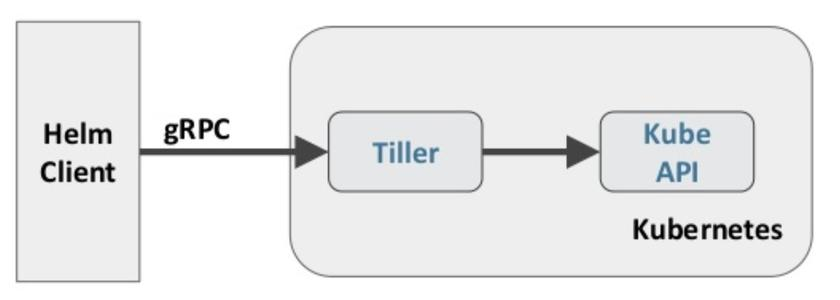

#### 使用Helm3管理复杂应用的部署

##### 认识Helm

1. 为什么有helm？

2. Helm是什么？

   kubernetes的包管理器，“可以将Helm看作Linux系统下的apt-get/yum”。  

   - 对于应用发布者而言，可以通过Helm打包应用，管理应用依赖关系，管理应用版本并发布应用到软件仓库。

   - 对于使用者而言，使用Helm后不用需要了解Kubernetes的Yaml语法并编写应用部署文件，可以通过Helm下载并在kubernetes上安装需要的应用。

   除此以外，Helm还提供了kubernetes上的软件部署，删除，升级，回滚应用的强大功能。

3. Helm的版本

   - helm2

     

     C/S架构，helm通过Tiller与k8s交互

   - helm3

     

     - 从安全性和易用性方面考虑，移除了Tiller服务端，helm3直接使用kubeconfig文件鉴权访问APIServer服务器

     - 由二路合并升级成为三路合并补丁策略（ 旧的配置，线上状态，新的配置 ）

       ```
       helm install very_important_app ./very_important_app
       ```

       这个应用的副本数量设置为 3 。现在，如果有人不小心执行了 `kubectl edit` 或：

       ```
       kubectl scale -replicas=0 deployment/very_important_app
       ```

       然后，团队中的某个人发现 very_important_app 莫名其妙宕机了，尝试执行命令：

       ```
       helm rollback very_important_app
       ```

       在 Helm 2 中，这个操作将比较旧的配置与新的配置，然后生成一个更新补丁。由于，误操作的人仅修改了应用的线上状态（旧的配置并未更新）。Helm 在回滚时，什么事情也不会做。因为旧的配置与新的配置没有差别（都是 3 个副本）。然后，Helm 不执行回滚，副本数继续保持为 0 

     - 移除了helm server本地repo仓库

     - 创建应用时必须指定名字（或者--generate-name随机生成）

4. Helm的重要概念

   - chart，应用的信息集合，包括各种对象的配置模板、参数定义、依赖关系、文档说明等
   - Repoistory，chart仓库，存储chart的地方，并且提供了一个该 Repository 的 Chart 包的清单文件以供查询。Helm 可以同时管理多个不同的 Repository。
   - release， 当 chart 被安装到 kubernetes 集群，就生成了一个 release ， 是 chart 的运行实例，代表了一个正在运行的应用 

helm 是包管理工具，包就是指 chart，helm 能够：

- 从零创建chart
- 与仓库交互，拉取、保存、更新 chart
- 在kubernetes集群中安装、卸载 release
- 更新、回滚、测试 release

##### 安装与快速入门实践

下载最新的稳定版本：https://get.helm.sh/helm-v3.2.4-linux-amd64.tar.gz

更多版本可以参考： https://github.com/helm/helm/releases 

```bash
# k8s-master节点
$ wget https://get.helm.sh/helm-v3.2.4-linux-amd64.tar.gz
$ tar -zxf helm-v3.2.4-linux-amd64.tar.gz

$ cp linux-amd64/helm /usr/local/bin/

# 验证安装
$ helm version
version.BuildInfo{Version:"v3.2.4", GitCommit:"0ad800ef43d3b826f31a5ad8dfbb4fe05d143688", GitTreeState:"clean", GoVersion:"go1.13.12"}
$ helm env

# 添加仓库
$ helm repo add stable https://charts.bitnami.com/bitnami
# 同步最新charts信息到本地
$ helm repo update


```


快速入门实践：

示例一：使用helm安装wordpress应用

```bash
# helm 搜索chart包
$ helm search repo wordpress

$ kubectl create namespace wordpress
# 从仓库安装
$ helm -n wordpress install wordpress stable/wordpress --set mariadb.primary.persistence.enabled=false --set service.type=ClusterIP --set ingress.enabled=true --set persistence.enabled=false --set ingress.hostname=wordpress.luffy.com

$ helm -n wordpress ls
$ kubectl -n wordpress get all 

# 从chart仓库中把chart包下载到本地
$ helm pull stable/wordpress
$ tree mysql
```


示例二：新建nginx的chart并安装

```bash
$ helm create nginx

# 从本地安装
$ helm install nginx ./nginx

# 安装到别的命名空间luffy
$ helm -n luffy install nginx ./nginx --set replicaCount=2 --set image.tag=alpine

# 查看
$ helm ls
$ helm -n luffy ls

#
$ kubectl -n luffy get all
```


##### Chart的模板语法及开发

###### nginx的chart实现分析

格式：

```bash
$ tree nginx/
nginx/
├── charts						# 存放子chart
├── Chart.yaml					# 该chart的全局定义信息
├── templates					# chart运行所需的资源清单模板，用于和values做渲染
│   ├── deployment.yaml
│   ├── _helpers.tpl			# 定义全局的命名模板，方便在其他模板中引入使用
│   ├── hpa.yaml
│   ├── ingress.yaml
│   ├── NOTES.txt				# helm安装完成后终端的提示信息
│   ├── serviceaccount.yaml
│   ├── service.yaml
│   └── tests
│       └── test-connection.yaml
└── values.yaml					# 模板使用的默认值信息
```

很明显，资源清单都在templates中，数据来源于values.yaml，安装的过程就是将模板与数据融合成k8s可识别的资源清单，然后部署到k8s环境中。


```bash
$ helm install debug-nginx ./ --dry-run --set replicaCount=2 --debug
```


分析模板文件的实现：

- 引用命名模板并传递作用域

  ```go
  {{ include "nginx.fullname" . }}
  ```

  include从_helpers.tpl中引用命名模板，并传递顶级作用域.

- 内置对象

  ```go
  .Values
  .Release.Name
  .Chart
  ```

  - `Release`：该对象描述了 release 本身的相关信息，它内部有几个对象：
    - `Release.Name`：release 名称
    - `Release.Namespace`：release 安装到的命名空间
    - `Release.IsUpgrade`：如果当前操作是升级或回滚，则该值为 true
    - `Release.IsInstall`：如果当前操作是安装，则将其设置为 true
    - `Release.Revision`：release 的 revision 版本号，在安装的时候，值为1，每次升级或回滚都会增加
    - `Release.Service`：渲染当前模板的服务，在 Helm 上，实际上该值始终为 Helm
  - `Values`：从 `values.yaml` 文件和用户提供的 values 文件传递到模板的 Values 值
  - `Chart`：获取 `Chart.yaml` 文件的内容，该文件中的任何数据都可以访问，例如 `{{ .Chart.Name }}-{{ .Chart.Version}}` 可以渲染成 `mychart-0.1.0`

- 模板定义

  ```go
  {{- define "nginx.fullname" -}}
  {{- if .Values.fullnameOverride }}
  {{- .Values.fullnameOverride | trunc 63 | trimSuffix "-" }}
  {{- else }}
  {{- $name := default .Chart.Name .Values.nameOverride }}
  {{- if contains $name .Release.Name }}
  {{- .Release.Name | trunc 63 | trimSuffix "-" }}
  {{- else }}
  {{- printf "%s-%s" .Release.Name $name | trunc 63 | trimSuffix "-" }}
  {{- end }}
  {{- end }}
  {{- end }}
  ```

  - {{-  去掉左边的空格及换行，-}}  去掉右侧的空格及换行

  - 示例

    ```yaml
    apiVersion: v1
    kind: ConfigMap
    metadata:
      name: {{ .Release.Name }}-configmap
    data:
      myvalue: "Hello World"
      drink: {{ .Values.favorite.drink | default "tea" | quote }}
      food: {{ .Values.favorite.food | upper | quote }}
      {{ if eq .Values.favorite.drink "coffee" }}
      mug: true
      {{ end }}
    ```

    渲染完后是：

    ```yaml
    apiVersion: v1
    kind: ConfigMap
    metadata:
      name: mychart-1575971172-configmap
    data:
      myvalue: "Hello World"
      drink: "coffee"
      food: "PIZZA"
    
      mug: true
    ```

    

- 管道及方法

  - trunc表示字符串截取，63作为参数传递给trunc方法，trimSuffix表示去掉`-`后缀

    ```go
    {{- .Values.fullnameOverride | trunc 63 | trimSuffix "-" }}
    ```

  - nindent表示前面的空格数

    ```go
      selector:
        matchLabels:
          {{- include "nginx.selectorLabels" . | nindent 6 }}
    ```

  - lower表示将内容小写，quote表示用双引号引起来

    ```go
    value: {{ include "mytpl" . | lower | quote }}
    ```

    

- 条件判断语句每个if对应一个end

  ```go
  {{- if .Values.fullnameOverride }}
  ...
  {{- else }}
  ...
  {{- end }}
  ```

  通常用来根据values.yaml中定义的开关来控制模板中的显示：

  ```go
  {{- if not .Values.autoscaling.enabled }}
    replicas: {{ .Values.replicaCount }}
  {{- end }}
  ```

- 定义变量，模板中可以通过变量名字去引用

  ```go
  {{- $name := default .Chart.Name .Values.nameOverride }}
  ```

- 遍历values的数据

  ```go
        {{- with .Values.nodeSelector }}
        nodeSelector:
          {{- toYaml . | nindent 8 }}
        {{- end }}
  ```

  toYaml处理值中的转义及特殊字符， "kubernetes.io/role"=master ， name="value1\,value2" 类似的情况

- default设置默认值

  ```go
  image: "{{ .Values.image.repository }}:{{ .Values.image.tag | default .Chart.AppVersion }}"
  ```

Helm template

hpa.yaml

```yaml
{{- if .Values.autoscaling.enabled }}
apiVersion: autoscaling/v2beta1
kind: HorizontalPodAutoscaler
metadata:
  name: {{ include "nginx.fullname" . }}
  labels:
    {{- include "nginx.labels" . | nindent 4 }}
spec:
  scaleTargetRef:
    apiVersion: apps/v1
    kind: Deployment
    name: {{ include "nginx.fullname" . }}
  minReplicas: {{ .Values.autoscaling.minReplicas }}
  maxReplicas: {{ .Values.autoscaling.maxReplicas }}
  metrics:
  {{- if .Values.autoscaling.targetCPUUtilizationPercentage }}
    - type: Resource
      resource:
        name: cpu
        targetAverageUtilization: {{ .Values.autoscaling.targetCPUUtilizationPercentage }}
  {{- end }}
  {{- if .Values.autoscaling.targetMemoryUtilizationPercentage }}
    - type: Resource
      resource:
        name: memory
        targetAverageUtilization: {{ .Values.autoscaling.targetMemoryUtilizationPercentage }}
  {{- end }}
{{- end }}
```

###### 创建Release的时候赋值

- set的方式

```bash
# 改变副本数和resource值
$ helm install nginx-2 ./nginx --set replicaCount=2 --set resources.limits.cpu=200m --set resources.limits.memory=256Mi

```

- value文件的方式

  ```bash
  $ cat nginx-values.yaml
  resources:
    limits:
      cpu: 100m
      memory: 128Mi
    requests:
      cpu: 100m
      memory: 128Mi
  autoscaling:
    enabled: true
    minReplicas: 1
    maxReplicas: 3
    targetCPUUtilizationPercentage: 80
  ingress:
    enabled: true
    hosts:
      - host: chart-example.luffy.com
        paths:
        - /
  
  $ helm install -f nginx-values.yaml nginx-3 ./nginx
  ```

使用helm template查看渲染模板
```bash
$ helm -n luffy template nginx ./nginx --set replicaCount=2 --set image.tag=alpine --set autoscaling.enabled=true
```

更多语法参考：

 https://helm.sh/docs/topics/charts/ 


##### 实战：使用Helm部署Harbor镜像及chart仓库

###### harbor部署

架构 https://github.com/goharbor/harbor/wiki/Architecture-Overview-of-Harbor 


- Core，核心组件
  - API Server，接收处理用户请求
  - Config Manager ：所有系统的配置，比如认证、邮件、证书配置等
  - Project Manager：项目管理
  - Quota Manager ：配额管理
  - Chart Controller：chart管理
  - Replication Controller ：镜像副本控制器，可以与不同类型的仓库实现镜像同步
    - Distribution (docker registry)
    - Docker Hub
    - ...
  - Scan Manager ：扫描管理，引入第三方组件，进行镜像安全扫描
  - Registry Driver ：镜像仓库驱动，目前使用docker registry
- Job Service，执行异步任务，如同步镜像信息
- Log Collector，统一日志收集器，收集各模块日志
- GC Controller
- Chart Museum，chart仓库服务，第三方
- Docker Registry，镜像仓库服务
- kv-storage，redis缓存服务，job service使用，存储job metadata
- local/remote storage，存储服务，比较镜像存储
- SQL Database，postgresl，存储用户、项目等元数据


通常用作企业级镜像仓库服务，实际功能强大很多。


组件众多，因此使用helm部署

```bash
# 添加harbor chart仓库
$ helm repo add harbor https://helm.goharbor.io

# 搜索harbor的chart
$ helm search repo harbor

# 不知道如何部署，因此拉到本地
$ helm pull harbor/harbor
```


创建pvc

```bash
$ kubectl create namespace harbor
$ cat harbor-pvc.yaml
apiVersion: v1
kind: PersistentVolumeClaim
metadata:
  name: harbor-data
  namespace: harbor
spec:
  accessModes:
  - ReadWriteMany
  resources:
    requests:
      storage: 20Gi
```

修改harbor配置：

- 开启ingress访问
- externalURL，web访问入口，和ingress的域名相同
- 持久化，使用PVC对接的cephfs
- harborAdminPassword: "Harbor12345"，管理员默认账户 admin/Harbor12345
- 开启chartmuseum
- clair和trivy漏洞扫描组件，暂不启用

helm创建：

```bash
# 使用本地chart安装
$ helm install harbor ./harbor -n harbor
```

数据权限问题：

- 数据库目录初始化无权限
- redis持久化数据目录权限导致无法登录
- registry组件的镜像存储目录权限导致镜像推送失败
- chartmuseum存储目录权限，导致chart推送失败

解决：

```bash
$ mount -t ceph 172.21.51.55:6789:/ /mnt/cephfs -o name=admin,secret=AQBPTstgc078NBAA78D1/KABglIZHKh7+G2X8w==

$ chown -R 999:999 database
$ chown -R 999:999 redis
$ chown -R 10000:10000 chartmuseum
$ chown -R 10000:10000 registry
$ chown -R 10000:10000 jobservice
```


###### 推送镜像到Harbor仓库

配置hosts及docker非安全仓库：

```bash
$ cat /etc/hosts
...
172.21.51.143 k8s-master harbor.luffy.com
...

$ cat /etc/docker/daemon.json
{                                            
  "insecure-registries": [                   
    "172.21.51.143:5000",                   
    "harbor.luffy.com"                     
  ],                                         
  "registry-mirrors" : [                     
    "https://8xpk5wnt.mirror.aliyuncs.com"   
  ]                                          
}                           

#
$ systemctl restart docker

# 使用账户密码登录admin/Harbor12345
$ docker login harbor.luffy.com

$ docker tag nginx:alpine harbor.luffy.com/library/nginx:alpine
$ docker push harbor.luffy.com/library/nginx:alpine
```


###### 推送chart到Harbor仓库

helm3默认没有安装helm push插件，需要手动安装。插件地址 https://github.com/chartmuseum/helm-push 

安装插件：

```bash
$ helm plugin install https://github.com/chartmuseum/helm-push
```

离线安装：

```bash
$ mkdir helm-push
$ wget https://github.com/chartmuseum/helm-push/releases/download/v0.8.1/helm-push_0.8.1_linux_amd64.tar.gz
$ tar zxf helm-push_0.8.1_linux_amd64.tar.gz -C helm-push
$ helm plugin install ./helm-push
```


添加repo

```bash
$ helm repo add myharbor https://harbor.luffy.com/chartrepo/luffy
# x509错误

# 添加证书信任，根证书为配置给ingress使用的证书
$ kubectl get secret harbor-ingress -n harbor -o jsonpath="{.data.ca\.crt}" | base64 -d >harbor.ca.crt

$ cp harbor.ca.crt /etc/pki/ca-trust/source/anchors
$ update-ca-trust enable; update-ca-trust extract

# 再次添加
$ helm repo add luffy https://harbor.luffy.com/chartrepo/luffy --ca-file=harbor.ca.crt  --username admin --password Harbor12345

$ helm repo ls

```


推送chart到仓库：

```bash
$ helm push harbor luffy --ca-file=harbor.ca.crt -u admin -p Harbor12345
```

