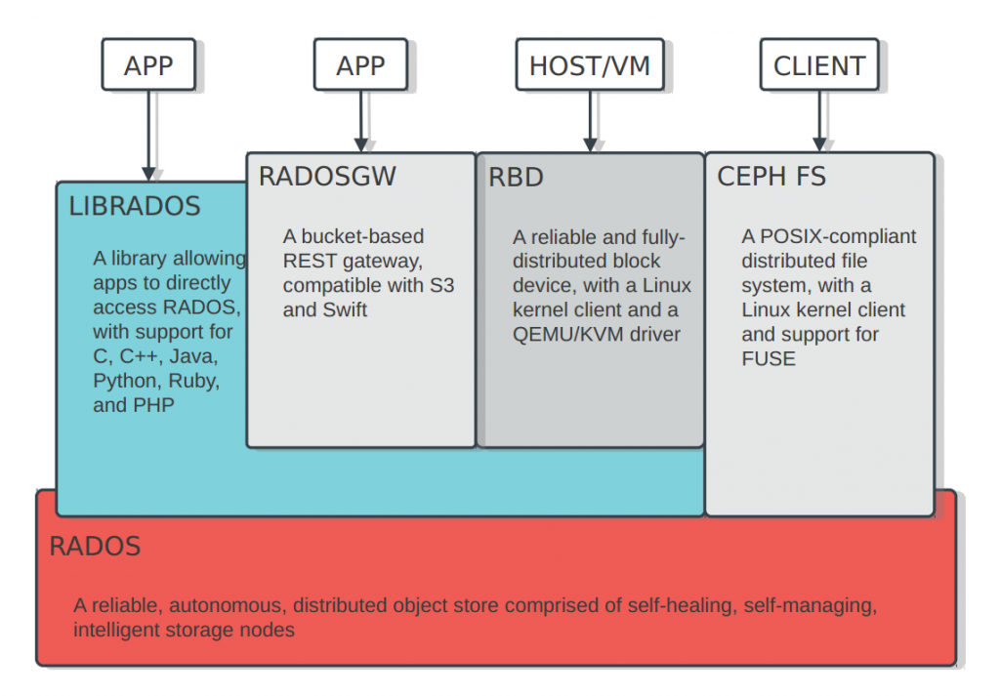

#### kubernetes对接分部式存储

##### PV与PVC快速入门

k8s存储的目的就是保证Pod重建后，数据不丢失。简单的数据持久化的下述方式：

- emptyDir 

  ```yaml
  apiVersion: v1
  kind: Pod
  metadata:
    name: test-pod
  spec:
    containers:
    - image: k8s.gcr.io/test-webserver
      name: webserver
      volumeMounts:
      - mountPath: /cache
        name: cache-volume
    - image: k8s.gcr.io/test-redis
      name: redis
      volumeMounts:
      - mountPath: /data
        name: cache-volume
  volumes:
    - name: cache-volume
      emptyDir: {}
  ```

  - Pod内的容器共享卷的数据
  - 存在于Pod的生命周期，Pod销毁，数据丢失
  - Pod内的容器自动重建后，数据不会丢失

- hostPath

  ```yaml
  apiVersion: v1
  kind: Pod
  metadata:
    name: test-pod
  spec:
    containers:
    - image: k8s.gcr.io/test-webserver
      name: test-container
      volumeMounts:
      - mountPath: /test-pod
        name: test-volume
    volumes:
    - name: test-volume
      hostPath:
        # directory location on host
        path: /data
        # this field is optional
        type: Directory
  ```

  通常配合nodeSelector使用

- nfs存储

  ```yaml
  ...
    volumes:
    - name: redisdata             #卷名称
      nfs:                        #使用NFS网络存储卷
        server: 192.168.31.241    #NFS服务器地址
        path: /data/redis         #NFS服务器共享的目录
        readOnly: false           #是否为只读
  ...
  ```

  

volume支持的种类众多（参考 https://kubernetes.io/docs/concepts/storage/volumes/#types-of-volumes ），每种对应不同的存储后端实现，因此为了屏蔽后端存储的细节，同时使得Pod在使用存储的时候更加简洁和规范，k8s引入了两个新的资源类型，PV和PVC。

PersistentVolume（持久化卷），是对底层的存储的一种抽象，它和具体的底层的共享存储技术的实现方式有关，比如 Ceph、GlusterFS、NFS 等，都是通过插件机制完成与共享存储的对接。如使用PV对接NFS存储：

```yaml
apiVersion: v1
kind: PersistentVolume
metadata:
  name: nfs-pv
spec:
  capacity: 
    storage: 1Gi
  accessModes:
  - ReadWriteMany
  persistentVolumeReclaimPolicy: Retain
  nfs:
    path: /data/k8s
    server: 172.21.51.55
```

- capacity，存储能力， 目前只支持存储空间的设置， 就是我们这里的 storage=1Gi，不过未来可能会加入 IOPS、吞吐量等指标的配置。 
- accessModes，访问模式， 是用来对 PV 进行访问模式的设置，用于描述用户应用对存储资源的访问权限，访问权限包括下面几种方式： 
  - ReadWriteOnce（RWO）：读写权限，但是只能被单个节点挂载
  - ReadOnlyMany（ROX）：只读权限，可以被多个节点挂载
  - ReadWriteMany（RWX）：读写权限，可以被多个节点挂载


- persistentVolumeReclaimPolicy，pv的回收策略, 目前只有 NFS 和 HostPath 两种类型支持回收策略 
  - Retain（保留）- 保留数据，需要管理员手工清理数据
  - Recycle（回收）- 清除 PV 中的数据，效果相当于执行 rm -rf /thevolume/*
  - Delete（删除）- 与 PV 相连的后端存储完成 volume 的删除操作，当然这常见于云服务商的存储服务，比如 ASW EBS。

因为PV是直接对接底层存储的，就像集群中的Node可以为Pod提供计算资源（CPU和内存）一样，PV可以为Pod提供存储资源。因此PV不是namespaced的资源，属于集群层面可用的资源。Pod如果想使用该PV，需要通过创建PVC挂载到Pod中。

PVC全写是PersistentVolumeClaim（持久化卷声明），PVC 是用户存储的一种声明，创建完成后，可以和PV实现一对一绑定。对于真正使用存储的用户不需要关心底层的存储实现细节，只需要直接使用 PVC 即可。

```yaml
apiVersion: v1
kind: PersistentVolumeClaim
metadata:
  name: pvc-nfs
  namespace: default
spec:
  accessModes:
  - ReadWriteMany
  resources:
    requests:
      storage: 1Gi
```

然后Pod中通过如下方式去使用：

```yaml
...
    spec:
      containers:
      - name: nginx
        image: nginx:alpine
        imagePullPolicy: IfNotPresent
        ports:
        - containerPort: 80
          name: web
        volumeMounts:                        #挂载容器中的目录到pvc nfs中的目录
        - name: www
          mountPath: /usr/share/nginx/html
      volumes:
      - name: www
        persistentVolumeClaim:              #指定pvc
          claimName: pvc-nfs
...
```


##### PV与PVC管理NFS存储卷实践

###### 环境准备

服务端：172.21.51.55

```bash
$ yum -y install nfs-utils rpcbind

# 共享目录
$ mkdir -p /data/k8s && chmod 755 /data/k8s

$ echo '/data/k8s  *(insecure,rw,sync,no_root_squash)'>>/etc/exports

$ systemctl enable rpcbind && systemctl start rpcbind
$ systemctl enable nfs && systemctl start nfs
```

客户端：k8s集群slave节点

```bash
$ yum -y install nfs-utils rpcbind
$ mkdir /nfsdata
$ mount -t nfs 172.21.51.55:/data/k8s /nfsdata
```

###### PV与PVC演示

```bash
$ cat pv-nfs.yaml
apiVersion: v1
kind: PersistentVolume
metadata:
  name: nfs-pv
spec:
  capacity: 
    storage: 1Gi
  accessModes:
  - ReadWriteMany
  persistentVolumeReclaimPolicy: Retain
  nfs:
    path: /data/k8s/nginx
    server: 172.21.51.55

$ kubectl create -f pv-nfs.yaml

$ kubectl get pv
NAME     CAPACITY   ACCESS MODES   RECLAIM POLICY   STATUS      CLAIM   STORAGECLASS  
nfs-pv   1Gi        RWO            Retain           Available

```

一个 PV 的生命周期中，可能会处于4中不同的阶段：

- Available（可用）：表示可用状态，还未被任何 PVC 绑定
- Bound（已绑定）：表示 PV 已经被 PVC 绑定
- Released（已释放）：PVC 被删除，但是资源还未被集群重新声明
- Failed（失败）： 表示该 PV 的自动回收失败

```bash
$ cat pvc.yaml
apiVersion: v1
kind: PersistentVolumeClaim
metadata:
  name: pvc-nfs
  namespace: default
spec:
  accessModes:
  - ReadWriteMany
  resources:
    requests:
      storage: 1Gi

$ kubectl create -f pvc.yaml
$ kubectl get pvc
NAME      STATUS   VOLUME   CAPACITY   ACCESS MODES   STORAGECLASS   AGE
pvc-nfs   Bound    nfs-pv   1Gi        RWO                           3s
$ kubectl get pv
NAME     CAPACITY   ACCESS MODES   RECLAIM POLICY   STATUS   CLAIM             
nfs-pv   1Gi        RWO            Retain           Bound    default/pvc-nfs             

#访问模式，storage大小（pvc大小需要小于pv大小），以及 PV 和 PVC 的 storageClassName 字段必须一样，这样才能够进行绑定。

#PersistentVolumeController会不断地循环去查看每一个 PVC，是不是已经处于 Bound（已绑定）状态。如果不是，那它就会遍历所有的、可用的 PV，并尝试将其与未绑定的 PVC 进行绑定，这样，Kubernetes 就可以保证用户提交的每一个 PVC，只要有合适的 PV 出现，它就能够很快进入绑定状态。而所谓将一个 PV 与 PVC 进行“绑定”，其实就是将这个 PV 对象的名字，填在了 PVC 对象的 spec.volumeName 字段上。

# 查看nfs数据目录
$ ls /nfsdata
```

创建Pod挂载pvc

```bash
$ cat deployment.yaml
apiVersion: apps/v1
kind: Deployment
metadata:
  name: nfs-pvc
spec:
  replicas: 1
  selector:		#指定Pod的选择器
    matchLabels:
      app: nginx
  template:
    metadata:
      labels:
        app: nginx
    spec:
      containers:
      - name: nginx
        image: nginx:alpine
        imagePullPolicy: IfNotPresent
        ports:
        - containerPort: 80
          name: web
        volumeMounts:                        #挂载容器中的目录到pvc nfs中的目录
        - name: www
          mountPath: /usr/share/nginx/html
      volumes:
      - name: www
        persistentVolumeClaim:              #指定pvc
          claimName: pvc-nfs
          
          
$ kubectl create -f deployment.yaml

# 查看容器/usr/share/nginx/html目录

# 删除pvc
```

###### storageClass实现动态挂载

创建pv及pvc过程是手动，且pv与pvc一一对应，手动创建很繁琐。因此，通过storageClass  +  provisioner的方式来实现通过PVC自动创建并绑定PV。


部署： https://github.com/kubernetes-retired/external-storage 

部署之前，需要修改api-server的参数，否则会报错
```bash
...
unexpected error getting claim reference: selfLink was empty, can't  make reference
...
```

为apiserver添加如下参数，重新启动即可：
```bash
- --feature-gates=RemoveSelfLink=false
```

`provisioner.yaml`

```yaml
apiVersion: apps/v1
kind: Deployment
metadata:
  name: nfs-client-provisioner
  labels:
    app: nfs-client-provisioner
  # replace with namespace where provisioner is deployed
  namespace: nfs-provisioner
spec:
  replicas: 1
  selector:
    matchLabels:
      app: nfs-client-provisioner
  strategy:
    type: Recreate
  selector:
    matchLabels:
      app: nfs-client-provisioner
  template:
    metadata:
      labels:
        app: nfs-client-provisioner
    spec:
      serviceAccountName: nfs-client-provisioner
      containers:
        - name: nfs-client-provisioner
          image: quay.io/external_storage/nfs-client-provisioner:latest
          volumeMounts:
            - name: nfs-client-root
              mountPath: /persistentvolumes
          env:
            - name: PROVISIONER_NAME
              value: luffy.com/nfs
            - name: NFS_SERVER
              value: 172.21.51.55
            - name: NFS_PATH  
              value: /data/k8s
      volumes:
        - name: nfs-client-root
          nfs:
            server: 172.21.51.55
            path: /data/k8s
```

`rbac.yaml`

```yaml
kind: ServiceAccount
apiVersion: v1
metadata:
  name: nfs-client-provisioner
  namespace: nfs-provisioner
---
kind: ClusterRole
apiVersion: rbac.authorization.k8s.io/v1
metadata:
  name: nfs-client-provisioner-runner
  namespace: nfs-provisioner
rules:
  - apiGroups: [""]
    resources: ["persistentvolumes"]
    verbs: ["get", "list", "watch", "create", "delete"]
  - apiGroups: [""]
    resources: ["persistentvolumeclaims"]
    verbs: ["get", "list", "watch", "update"]
  - apiGroups: ["storage.k8s.io"]
    resources: ["storageclasses"]
    verbs: ["get", "list", "watch"]
  - apiGroups: [""]
    resources: ["events"]
    verbs: ["create", "update", "patch"]
---
kind: ClusterRoleBinding
apiVersion: rbac.authorization.k8s.io/v1
metadata:
  name: run-nfs-client-provisioner
  namespace: nfs-provisioner
subjects:
  - kind: ServiceAccount
    name: nfs-client-provisioner
    namespace: nfs-provisioner
roleRef:
  kind: ClusterRole
  name: nfs-client-provisioner-runner
  apiGroup: rbac.authorization.k8s.io
---
kind: Role
apiVersion: rbac.authorization.k8s.io/v1
metadata:
  name: leader-locking-nfs-client-provisioner
  namespace: nfs-provisioner
rules:
  - apiGroups: [""]
    resources: ["endpoints"]
    verbs: ["get", "list", "watch", "create", "update", "patch"]
---
kind: RoleBinding
apiVersion: rbac.authorization.k8s.io/v1
metadata:
  name: leader-locking-nfs-client-provisioner
  namespace: nfs-provisioner
subjects:
  - kind: ServiceAccount
    name: nfs-client-provisioner
    # replace with namespace where provisioner is deployed
    namespace: nfs-provisioner
roleRef:
  kind: Role
  name: leader-locking-nfs-client-provisioner
  apiGroup: rbac.authorization.k8s.io
```

`storage-class.yaml`

```yaml
apiVersion: storage.k8s.io/v1
kind: StorageClass
metadata:
  annotations:
    storageclass.kubernetes.io/is-default-class: "true"   # 设置为default StorageClass
  name: nfs
provisioner: luffy.com/nfs
parameters:
  archiveOnDelete: "true"

```


`pvc.yaml`

```yaml
kind: PersistentVolumeClaim
apiVersion: v1
metadata:
  name: test-claim
spec:
  accessModes:
    - ReadWriteMany
  resources:
    requests:
      storage: 1Mi
  storageClassName: nfs
```


##### 对接Ceph存储实践

ceph的安装及使用参考 http://docs.ceph.org.cn/start/intro/ 

单点快速安装：  https://blog.csdn.net/h106140873/article/details/90201379 



```bash
# CephFS需要使用两个Pool来分别存储数据和元数据
ceph osd pool create cephfs_data 128
ceph osd pool create cephfs_meta 128
ceph osd lspools

# 创建一个CephFS
ceph fs new cephfs cephfs_meta cephfs_data

# 查看
ceph fs ls

# ceph auth get-key client.admin
client.admin
        key: AQBPTstgc078NBAA78D1/KABglIZHKh7+G2X8w==
# 挂载
$ mount -t ceph 172.21.51.55:6789:/ /mnt/cephfs -o name=admin,secret=AQBPTstgc078NBAA78D1/KABglIZHKh7+G2X8w==
```


###### storageClass实现动态挂载

创建pv及pvc过程是手动，且pv与pvc一一对应，手动创建很繁琐。因此，通过storageClass  +  provisioner的方式来实现通过PVC自动创建并绑定PV。


比如，针对cephfs，可以创建如下类型的storageclass：

```yaml
kind: StorageClass
apiVersion: storage.k8s.io/v1
metadata:
  name: dynamic-cephfs
provisioner: ceph.com/cephfs
parameters:
    monitors: 172.21.51.55:6789
    adminId: admin
    adminSecretName: ceph-admin-secret
    adminSecretNamespace: "kube-system"
    claimRoot: /volumes/kubernetes
```

NFS，ceph-rbd，cephfs均提供了对应的provisioner


部署cephfs-provisioner

```bash
$ cat external-storage-cephfs-provisioner.yaml
apiVersion: v1
kind: ServiceAccount
metadata:
  name: cephfs-provisioner
  namespace: kube-system
---
kind: ClusterRole
apiVersion: rbac.authorization.k8s.io/v1
metadata:
  name: cephfs-provisioner
rules:
  - apiGroups: [""]
    resources: ["persistentvolumes"]
    verbs: ["get", "list", "watch", "create", "delete"]
  - apiGroups: [""]
    resources: ["persistentvolumeclaims"]
    verbs: ["get", "list", "watch", "update"]
  - apiGroups: ["storage.k8s.io"]
    resources: ["storageclasses"]
    verbs: ["get", "list", "watch"]
  - apiGroups: [""]
    resources: ["events"]
    verbs: ["create", "update", "patch"]
  - apiGroups: [""]
    resources: ["endpoints"]
    verbs: ["get", "list", "watch", "create", "update", "patch"]
  - apiGroups: [""]
    resources: ["secrets"]
    verbs: ["create", "get", "delete"]
---
kind: ClusterRoleBinding
apiVersion: rbac.authorization.k8s.io/v1
metadata:
  name: cephfs-provisioner
subjects:
  - kind: ServiceAccount
    name: cephfs-provisioner
    namespace: kube-system
roleRef:
  kind: ClusterRole
  name: cephfs-provisioner
  apiGroup: rbac.authorization.k8s.io


---
apiVersion: apps/v1
kind: Deployment
metadata:
  name: cephfs-provisioner
  namespace: kube-system
spec:
  replicas: 1
  selector:
    matchLabels:
      app: cephfs-provisioner
  strategy:
    type: Recreate
  template:
    metadata:
      labels:
        app: cephfs-provisioner
    spec:
      containers:
      - name: cephfs-provisioner
        image: "quay.io/external_storage/cephfs-provisioner:latest"
        env:
        - name: PROVISIONER_NAME
          value: ceph.com/cephfs
        imagePullPolicy: IfNotPresent
        command:
        - "/usr/local/bin/cephfs-provisioner"
        args:
        - "-id=cephfs-provisioner-1"
        - "-disable-ceph-namespace-isolation=true"
      serviceAccount: cephfs-provisioner
```


在ceph monitor机器中查看admin账户的key

```bash
$ ceph auth list
$ ceph auth get-key client.admin
AQBPTstgc078NBAA78D1/KABglIZHKh7+G2X8w==
```


创建secret

```bash
$ echo -n AQBPTstgc078NBAA78D1/KABglIZHKh7+G2X8w==|base64
QVFCUFRzdGdjMDc4TkJBQTc4RDEvS0FCZ2xJWkhLaDcrRzJYOHc9PQ==
$ cat ceph-admin-secret.yaml
apiVersion: v1
data:
  key: QVFCUFRzdGdjMDc4TkJBQTc4RDEvS0FCZ2xJWkhLaDcrRzJYOHc9PQ==
kind: Secret
metadata:
  name: ceph-admin-secret
  namespace: kube-system
type: Opaque
```


创建storageclass

```bash
$ cat cephfs-storage-class.yaml
kind: StorageClass
apiVersion: storage.k8s.io/v1
metadata:
  name: dynamic-cephfs
provisioner: ceph.com/cephfs
parameters:
    monitors: 172.21.51.55:6789
    adminId: admin
    adminSecretName: ceph-admin-secret
    adminSecretNamespace: "kube-system"
    claimRoot: /volumes/kubernetes
```


###### 动态pvc验证及实现分析

使用流程： 创建pvc，指定storageclass和存储大小，即可实现动态存储。

创建pvc测试自动生成pv

```bash
$ cat cephfs-pvc-test.yaml
kind: PersistentVolumeClaim
apiVersion: v1
metadata:
  name: cephfs-claim
spec:
  accessModes:     
    - ReadWriteOnce
  storageClassName: dynamic-cephfs
  resources:
    requests:
      storage: 2Gi

$ kubectl create -f cephfs-pvc-test.yaml

$ kubectl get pv
pvc-2abe427e-7568-442d-939f-2c273695c3db   2Gi        RWO            Delete           Bound      default/cephfs-claim   dynamic-cephfs            1s

```

创建Pod使用pvc挂载cephfs数据盘

```bash
$ cat test-pvc-cephfs.yaml
apiVersion: v1
kind: Pod
metadata:
  name: nginx-pod
  labels:
    name: nginx-pod
spec:
  containers:
  - name: nginx-pod
    image: nginx:alpine
    ports:
    - name: web
      containerPort: 80
    volumeMounts:
    - name: cephfs
      mountPath: /usr/share/nginx/html
  volumes:
  - name: cephfs
    persistentVolumeClaim:
      claimName: cephfs-claim
      
$ kubectl create -f test-pvc-cephfs.yaml

```

我们所说的容器的持久化，实际上应该理解为宿主机中volume的持久化，因为Pod是支持销毁重建的，所以只能通过宿主机volume持久化，然后挂载到Pod内部来实现Pod的数据持久化。

宿主机上的volume持久化，因为要支持数据漂移，所以通常是数据存储在分布式存储中，宿主机本地挂载远程存储（NFS，Ceph，OSS），这样即使Pod漂移也不影响数据。

k8s的pod的挂载盘通常的格式为：

```bash
/var/lib/kubelet/pods/<Pod的ID>/volumes/kubernetes.io~<Volume类型>/<Volume名字>
```

查看nginx-pod的挂载盘，

```bash
$ df -TH
/var/lib/kubelet/pods/61ba43c5-d2e9-4274-ac8c-008854e4fa8e/volumes/kubernetes.io~cephfs/pvc-2abe427e-7568-442d-939f-2c273695c3db/

$ findmnt /var/lib/kubelet/pods/61ba43c5-d2e9-4274-ac8c-008854e4fa8e/volumes/kubernetes.io~cephfs/pvc-2abe427e-7568-442d-939f-2c273695c3db/

172.21.51.55:6789:/volumes/kubernetes/kubernetes/kubernetes-dynamic-pvc-ffe3d84d-c433-11ea-b347-6acc3cf3c15f
```


