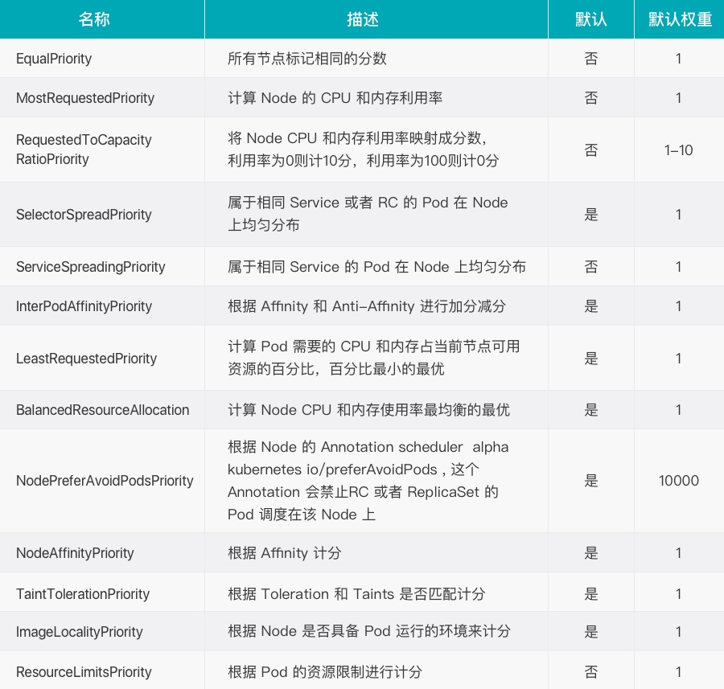

#### Kubernetes调度 

######  为何要控制Pod应该如何调度 

- 集群中有些机器的配置高（SSD，更好的内存等），我们希望核心的服务（比如说数据库）运行在上面
- 某两个服务的网络传输很频繁，我们希望它们最好在同一台机器上 
- ......

Kubernetes Scheduler 的作用是将待调度的 Pod 按照一定的调度算法和策略绑定到集群中一个合适的 Worker Node 上，并将绑定信息写入到 etcd 中，之后目标 Node 中 kubelet 服务通过 API Server 监听到 Scheduler 产生的 Pod 绑定事件获取 Pod 信息，然后下载镜像启动容器。


###### 调度的过程

Scheduler 提供的调度流程分为预选 (Predicates) 和优选 (Priorities) 两个步骤：

- 预选，K8S会遍历当前集群中的所有 Node，筛选出其中符合要求的 Node 作为候选
- 优选，K8S将对候选的 Node 进行打分

经过预选筛选和优选打分之后，K8S选择分数最高的 Node 来运行 Pod，如果最终有多个 Node 的分数最高，那么 Scheduler 将从当中随机选择一个 Node 来运行 Pod。


预选：


优选：



###### NodeSelector

 `label`是`kubernetes`中一个非常重要的概念，用户可以非常灵活的利用 label 来管理集群中的资源，POD 的调度可以根据节点的 label 进行特定的部署。 

查看节点的label：

```bash
$ kubectl get nodes --show-labels
```

为节点打label：

```bash
$ kubectl label node k8s-master disktype=ssd
```

 当 node 被打上了相关标签后，在调度的时候就可以使用这些标签了，只需要在spec 字段中添加`nodeSelector`字段，里面是我们需要被调度的节点的 label。 

```yaml
...
spec:
  hostNetwork: true	# 声明pod的网络模式为host模式，效果通docker run --net=host
  volumes: 
  - name: mysql-data
    hostPath: 
      path: /opt/mysql/data
  nodeSelector:   # 使用节点选择器将Pod调度到指定label的节点
    component: mysql
  containers:
  - name: mysql
  	image: 172.21.51.143:5000/demo/mysql:5.7
...

```

###### nodeAffinity

Pod -> Node的标签

节点亲和性 ， 比上面的`nodeSelector`更加灵活，它可以进行一些简单的逻辑组合，不只是简单的相等匹配 。分为两种，硬策略和软策略。

requiredDuringSchedulingIgnoredDuringExecution ： 硬策略，如果没有满足条件的节点的话，就不断重试直到满足条件为止，简单说就是你必须满足我的要求，不然我就不会调度Pod。

preferredDuringSchedulingIgnoredDuringExecution：软策略，如果你没有满足调度要求的节点的话，Pod就会忽略这条规则，继续完成调度过程，说白了就是满足条件最好了，没有满足就忽略掉的策略。

```yaml
#要求 Pod 不能运行在128和132两个节点上，如果有节点满足disktype=ssd或者sas的话就优先调度到这类节点上
...
spec:
      containers:
      - name: demo
        image: 172.21.51.143:5000/myblog:v1
        ports:
        - containerPort: 8002
      affinity:
          nodeAffinity:
            requiredDuringSchedulingIgnoredDuringExecution:
                nodeSelectorTerms:
                - matchExpressions:
                    - key: kubernetes.io/hostname
                      operator: NotIn
                      values:
                        - 192.168.136.128
                        - 192.168.136.132
                        
            preferredDuringSchedulingIgnoredDuringExecution:
                - weight: 1
                  preference:
                    matchExpressions:
                    - key: disktype
                      operator: In
                      values:
                        - ssd
                        - sas
...
```

这里的匹配逻辑是 label 的值在某个列表中，现在`Kubernetes`提供的操作符有下面的几种：

- In：label 的值在某个列表中
- NotIn：label 的值不在某个列表中
- Gt：label 的值大于某个值
- Lt：label 的值小于某个值
- Exists：某个 label 存在
- DoesNotExist：某个 label 不存在

*如果nodeSelectorTerms下面有多个选项的话，满足任何一个条件就可以了；如果matchExpressions有多个选项的话，则必须同时满足这些条件才能正常调度 Pod*

###### pod亲和性和反亲和性

Pod -> Pod的标签

场景：

> myblog 启动多副本，但是期望可以尽量分散到集群的可用节点中

分析：为了让myblog应用的多个pod尽量分散部署在集群中，可以利用pod的反亲和性，告诉调度器，如果某个节点中存在了myblog的pod，则可以根据实际情况，实现如下调度策略：

- 不允许同一个node节点，调度两个myblog的副本
- 可以允许同一个node节点中调度两个myblog的副本，前提是尽量把pod分散部署在集群中

```yaml
...
    spec:
      affinity:
        podAntiAffinity:
          requiredDuringSchedulingIgnoredDuringExecution:
          - labelSelector:
              matchExpressions:
              - key: app
                operator: In
                values:
                - myblog
            topologyKey: kubernetes.io/hostname
      containers:
...
# 如果某个节点中，存在了app=myblog的label的pod，那么 调度器一定不要给我调度过去

...
    spec:
      affinity:
        podAntiAffinity:
          preferredDuringSchedulingIgnoredDuringExecution:
          - weight: 100
            podAffinityTerm:
              labelSelector:
                matchExpressions:
                - key: app
                  operator: In
                  values:
                  - myblog
              topologyKey: kubernetes.io/hostname
      containers:
...
# 如果某个节点中，存在了app=myblog的label的pod，那么调度器尽量不要调度过去
```

> https://kubernetes.io/zh/docs/concepts/scheduling-eviction/assign-pod-node/

###### 污点（Taints）与容忍（tolerations）

对于`nodeAffinity`无论是硬策略还是软策略方式，都是调度 Pod 到预期节点上，而`Taints`恰好与之相反，如果一个节点标记为 Taints ，除非 Pod 也被标识为可以容忍污点节点，否则该 Taints 节点不会被调度Pod。

Taints(污点)是Node的一个属性，设置了Taints(污点)后，因为有了污点，所以Kubernetes是不会将Pod调度到这个Node上的。于是Kubernetes就给Pod设置了个属性Tolerations(容忍)，只要Pod能够容忍Node上的污点，那么Kubernetes就会忽略Node上的污点，就能够(不是必须)把Pod调度过去。

场景一：私有云服务中，某业务使用GPU进行大规模并行计算。为保证性能，希望确保该业务对服务器的专属性，避免将普通业务调度到部署GPU的服务器。

场景二：用户希望把 Master 节点保留给 Kubernetes 系统组件使用，或者把一组具有特殊资源预留给某些 Pod，则污点就很有用了，Pod 不会再被调度到 taint 标记过的节点。taint 标记节点举例如下：

设置污点：

```bash
$ kubectl taint node [node_name] key=value:[effect]   
      其中[effect] 可取值： [ NoSchedule | PreferNoSchedule | NoExecute ]
       NoSchedule：一定不能被调度。
       PreferNoSchedule：尽量不要调度。
       NoExecute：不仅不会调度，还会驱逐Node上已有的Pod。
  示例：kubectl taint node k8s-slave1 smoke=true:NoSchedule

```

去除污点：

```bash
去除指定key及其effect：
     kubectl taint nodes [node_name] key:[effect]-    #这里的key不用指定value
     kubectl taint node k8s-slave1 smoke-
 去除指定key所有的effect: 
     kubectl taint nodes node_name key-
 
 示例：
     kubectl taint node k8s-master smoke=true:NoSchedule
     kubectl taint node k8s-master smoke:NoExecute-
     kubectl taint node k8s-master smoke-

```

污点演示：

```bash
## 给k8s-slave1打上污点，smoke=true:NoSchedule
$ kubectl taint node k8s-master gamble=true:NoSchedule
$ kubectl taint node k8s-slave1 drunk=true:NoSchedule
$ kubectl taint node k8s-slave2 smoke=true:NoSchedule


## 扩容myblog的Pod，观察新Pod的调度情况
$ kuebctl -n luffy scale deploy myblog --replicas=3
$ kubectl -n luffy get po -w    ## pending

```


Pod容忍污点示例：`myblog/deployment/deploy-myblog-taint.yaml`

```bash
...
spec:
      containers:
      - name: demo
        image: 172.21.51.143:5000/myblog:v1
      tolerations: #设置容忍性
      - key: "smoke" 
        operator: "Equal"  #不指定operator，默认为Equal
        value: "true"
        effect: "NoSchedule"
      - key: "drunk" 
        operator: "Exists"  #如果操作符为Exists，那么value属性可省略,不指定operator，默认为Equal
	  #意思是这个Pod要容忍的有污点的Node的key是smoke Equal true,效果是NoSchedule，
      #tolerations属性下各值必须使用引号，容忍的值都是设置Node的taints时给的值。
```

```bash
$ kubectl apply -f deploy-myblog-taint.yaml
```

```bash
spec:
      containers:
      - name: demo
        image: 172.21.51.143:5000/myblog:v1
      tolerations:
        - operator: "Exists"
```

>  NoExecute


###### Cordon

```bash
$ kubectl cordon k8s-slave2
$ kubectl drain k8s-slave2
```


