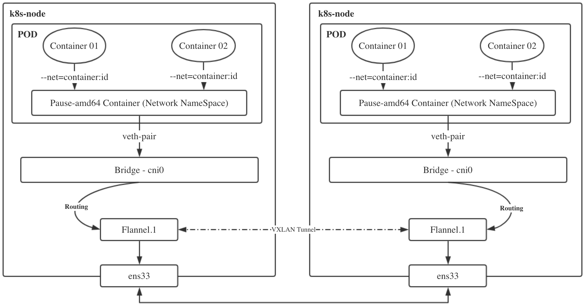
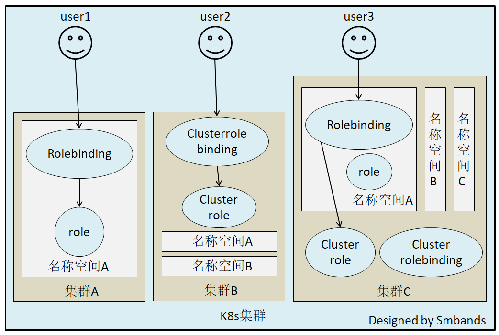
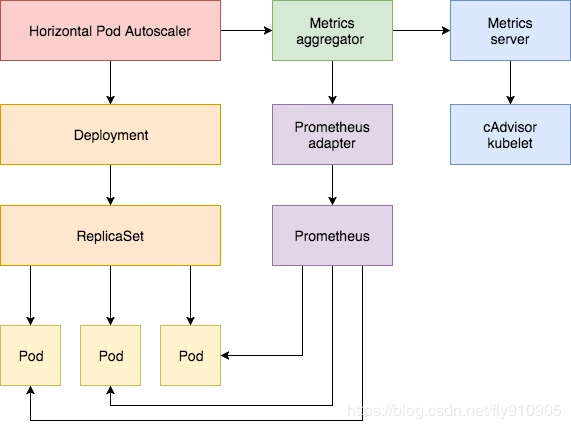

#### 课程小结

使用k8s的进阶内容。

1. 学习k8s在etcd中数据的存储，掌握etcd的基本操作命令

2. 理解k8s调度的过程，预选及优先。影响调度策略的设置

   

3. Flannel网络的原理学习，了解网络的流向，帮助定位问题

   

4. 认证与授权，掌握kubectl、kubelet、rbac及二次开发如何调度API

   

5. 利用HPA进行业务动态扩缩容，通过metrics-server了解整个k8s的监控体系

   

   

6. PV + PVC

   

7. Helm

   

