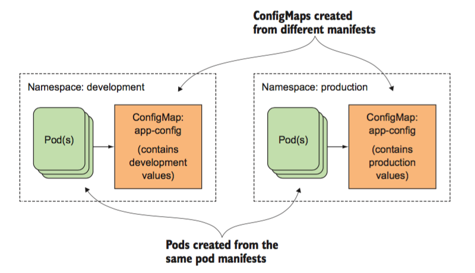

###### yaml优化

目前完善后的yaml，`myblog/one-pod/pod-completed.yaml`

```yaml
apiVersion: v1
kind: Pod
metadata:
  name: myblog
  namespace: luffy
  labels:
    component: myblog
spec:
  volumes: 
  - name: mysql-data
    hostPath: 
      path: /opt/mysql/data
  nodeSelector:   # 使用节点选择器将Pod调度到指定label的节点
    component: mysql
  containers:
  - name: myblog
    image: 172.21.51.143:5000/myblog:v1
    env:
    - name: MYSQL_HOST   #  指定root用户的用户名
      value: "127.0.0.1"
    - name: MYSQL_PASSWD
      value: "123456"
    ports:
    - containerPort: 8002
    resources:
      requests:
        memory: 100Mi
        cpu: 50m
      limits:
        memory: 500Mi
        cpu: 100m
    livenessProbe:
      httpGet:
        path: /blog/index/
        port: 8002
        scheme: HTTP
      initialDelaySeconds: 10  # 容器启动后第一次执行探测是需要等待多少秒
      periodSeconds: 15 	# 执行探测的频率
      timeoutSeconds: 2		# 探测超时时间
    readinessProbe: 
      httpGet: 
        path: /blog/index/
        port: 8002
        scheme: HTTP
      initialDelaySeconds: 10 
      timeoutSeconds: 2
      periodSeconds: 15
  - name: mysql
    image: mysql:5.7
    args:
    - --character-set-server=utf8mb4
    - --collation-server=utf8mb4_unicode_ci
    ports:
    - containerPort: 3306
    env:
    - name: MYSQL_ROOT_PASSWORD
      value: "123456"
    - name: MYSQL_DATABASE
      value: "myblog"
    resources:
      requests:
        memory: 100Mi
        cpu: 50m
      limits:
        memory: 500Mi
        cpu: 100m
    readinessProbe:
      tcpSocket:
        port: 3306
      initialDelaySeconds: 5
      periodSeconds: 10
    livenessProbe:
      tcpSocket:
        port: 3306
      initialDelaySeconds: 15
      periodSeconds: 20
    volumeMounts:
    - name: mysql-data
      mountPath: /var/lib/mysql


```

为什么要优化

- 考虑真实的使用场景，像数据库这类中间件，是作为公共资源，为多个项目提供服务，不适合和业务容器绑定在同一个Pod中，因为业务容器是经常变更的，而数据库不需要频繁迭代
- yaml的环境变量中存在敏感信息（账号、密码），存在安全隐患

解决问题一，需要拆分yaml

`myblog/two-pod/mysql.yaml`

```yaml
apiVersion: v1
kind: Pod
metadata:
  name: mysql
  namespace: luffy
  labels:
    component: mysql
spec:
  hostNetwork: true	# 声明pod的网络模式为host模式，效果同docker run --net=host
  volumes: 
  - name: mysql-data
    hostPath: 
      path: /opt/mysql/data
  nodeSelector:   # 使用节点选择器将Pod调度到指定label的节点
    component: mysql
  containers:
  - name: mysql
    image: mysql:5.7
    args:
    - --character-set-server=utf8mb4
    - --collation-server=utf8mb4_unicode_ci
    ports:
    - containerPort: 3306
    env:
    - name: MYSQL_ROOT_PASSWORD
      value: "123456"
    - name: MYSQL_DATABASE
      value: "myblog"
    resources:
      requests:
        memory: 100Mi
        cpu: 50m
      limits:
        memory: 500Mi
        cpu: 100m
    readinessProbe:
      tcpSocket:
        port: 3306
      initialDelaySeconds: 5
      periodSeconds: 10
    livenessProbe:
      tcpSocket:
        port: 3306
      initialDelaySeconds: 15
      periodSeconds: 20
    volumeMounts:
    - name: mysql-data
      mountPath: /var/lib/mysql


```

myblog.yaml

```yaml
apiVersion: v1
kind: Pod
metadata:
  name: myblog
  namespace: luffy
  labels:
    component: myblog
spec:
  containers:
  - name: myblog
    image: 172.21.51.143:5000/myblog:v1
    imagePullPolicy: IfNotPresent
    env:
    - name: MYSQL_HOST   #  指定root用户的用户名
      value: "172.21.51.55"
    - name: MYSQL_PASSWD
      value: "123456"
    ports:
    - containerPort: 8002
    resources:
      requests:
        memory: 100Mi
        cpu: 50m
      limits:
        memory: 500Mi
        cpu: 100m
    livenessProbe:
      httpGet:
        path: /blog/index/
        port: 8002
        scheme: HTTP
      initialDelaySeconds: 10  # 容器启动后第一次执行探测是需要等待多少秒
      periodSeconds: 15 	# 执行探测的频率
      timeoutSeconds: 2		# 探测超时时间
    readinessProbe: 
      httpGet: 
        path: /blog/index/
        port: 8002
        scheme: HTTP
      initialDelaySeconds: 10 
      timeoutSeconds: 2
      periodSeconds: 15

```

创建测试

```bash
## 先删除旧pod
$ kubectl -n luffy delete po myblog

## 分别创建mysql和myblog
$ kubectl create -f mysql.yaml
$ kubectl create -f myblog.yaml

## 查看pod，注意mysqlIP为宿主机IP，因为网络模式为host
$ kubectl -n luffy get po -o wide 
NAME     READY   STATUS    RESTARTS   AGE   IP                NODE
myblog   1/1     Running   0          41s   10.244.1.152      k8s-slave1
mysql    1/1     Running   0          52s   172.21.51.67   k8s-slave1

## 访问myblog服务正常
$ curl 10.244.1.152:8002/blog/index/

```


解决问题二，环境变量中敏感信息带来的安全隐患

为什么要统一管理环境变量

- 环境变量中有很多敏感的信息，比如账号密码，直接暴漏在yaml文件中存在安全性问题
- 团队内部一般存在多个项目，这些项目直接存在配置相同环境变量的情况，因此可以统一维护管理
- 对于开发、测试、生产环境，由于配置均不同，每套环境部署的时候都要修改yaml，带来额外的开销

k8s提供两类资源，configMap和Secret，可以用来实现业务配置的统一管理， 允许将配置文件与镜像文件分离，以使容器化的应用程序具有可移植性 。



- configMap，通常用来管理应用的配置文件或者环境变量，`myblog/two-pod/configmap.yaml`

  ```yaml
  apiVersion: v1
  kind: ConfigMap
  metadata:
    name: myblog
    namespace: luffy
  data:
    MYSQL_HOST: "172.21.51.55"
    MYSQL_PORT: "3306"
  
  
  ```

  创建并查看configMap：

  ```bash
  $ kubectl create -f configmap.yaml
  $ kubectl -n luffy get cm myblog -oyaml
  
  ```

  或者可以使用命令的方式，从文件中创建，比如：

  configmap.txt

  ```bash
  $ cat configmap.txt
  MYSQL_HOST=172.21.51.55
  MYSQL_PORT=3306
  $ kubectl create configmap myblog --from-env-file=configmap.txt
  
  ```


- Secret，管理敏感类的信息，默认会base64编码存储，有三种类型

  - Service Account ：用来访问Kubernetes API，由Kubernetes自动创建，并且会自动挂载到Pod的/run/secrets/kubernetes.io/serviceaccount目录中；创建ServiceAccount后，Pod中指定serviceAccount后，自动创建该ServiceAccount对应的secret；
  - Opaque ： base64编码格式的Secret，用来存储密码、密钥等；
  - kubernetes.io/dockerconfigjson ：用来存储私有docker registry的认证信息。

  `myblog/two-pod/secret.yaml`

  ```yaml
  apiVersion: v1
  kind: Secret
  metadata:
    name: myblog
    namespace: luffy
  type: Opaque
  data:
    MYSQL_USER: cm9vdA==		#注意加-n参数， echo -n root|base64
    MYSQL_PASSWD: MTIzNDU2
  
  
  ```

  创建并查看：

  ```bash
  $ kubectl create -f secret.yaml
  $ kubectl -n luffy get secret
  
  
  ```

  如果不习惯这种方式，可以通过如下方式：

  ```bash
  $ cat secret.txt
  MYSQL_USER=root
  MYSQL_PASSWD=123456
  $ kubectl -n luffy create secret generic myblog --from-env-file=secret.txt 
  
  
  ```

修改后的mysql的yaml，资源路径：`myblog/two-pod/mysql-with-config.yaml`

```yaml
...
spec:
  containers:
  - name: mysql
    args:
    - --character-set-server=utf8mb4
    - --collation-server=utf8mb4_unicode_ci
    env:
    - name: MYSQL_USER
      valueFrom:
        secretKeyRef:
          name: myblog
          key: MYSQL_USER
    - name: MYSQL_ROOT_PASSWORD
      valueFrom:
        secretKeyRef:
          name: myblog
          key: MYSQL_PASSWD
    - name: MYSQL_DATABASE
      value: "myblog"
...


```

整体修改后的myblog的yaml，资源路径：`myblog/two-pod/myblog-with-config.yaml`

```yaml
apiVersion: v1
kind: Pod
metadata:
  name: myblog
  namespace: luffy
  labels:
    component: myblog
spec:
  containers:
  - name: myblog
    image: 172.21.51.143:5000/myblog:v1
    imagePullPolicy: IfNotPresent
    env:
    - name: MYSQL_HOST
      valueFrom:
        configMapKeyRef:
          name: myblog
          key: MYSQL_HOST
    - name: MYSQL_PORT
      valueFrom:
        configMapKeyRef:
          name: myblog
          key: MYSQL_PORT
    - name: MYSQL_USER
      valueFrom:
        secretKeyRef:
          name: myblog
          key: MYSQL_USER
    - name: MYSQL_PASSWD
      valueFrom:
        secretKeyRef:
          name: myblog
          key: MYSQL_PASSWD
    ports:
    - containerPort: 8002
    resources:
      requests:
        memory: 100Mi
        cpu: 50m
      limits:
        memory: 500Mi
        cpu: 100m
    livenessProbe:
      httpGet:
        path: /blog/index/
        port: 8002
        scheme: HTTP
      initialDelaySeconds: 10  # 容器启动后第一次执行探测是需要等待多少秒
      periodSeconds: 15 	# 执行探测的频率
      timeoutSeconds: 2		# 探测超时时间
    readinessProbe: 
      httpGet: 
        path: /blog/index/
        port: 8002
        scheme: HTTP
      initialDelaySeconds: 10 
      timeoutSeconds: 2
      periodSeconds: 15

```

在部署不同的环境时，pod的yaml无须再变化，只需要在每套环境中维护一套ConfigMap和Secret即可。但是注意configmap和secret不能跨namespace使用，且更新后，pod内的env不会自动更新，重建后方可更新。

