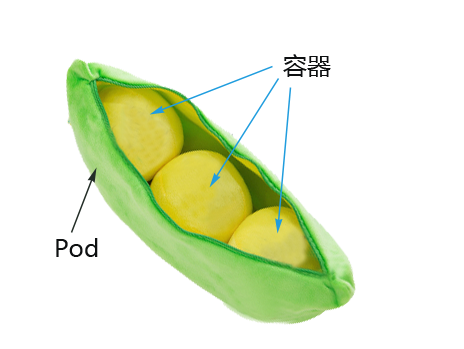

##### 最小调度单元 Pod

docker调度的是容器，在k8s集群中，最小的调度单元是Pod（豆荚）



###### 为什么引入Pod

- 与容器引擎解耦

  Docker、Rkt。平台设计与引擎的具体的实现解耦

- 多容器共享网络|存储|进程 空间, 支持的业务场景更加灵活

###### 使用yaml格式定义Pod

*myblog/one-pod/pod.yaml*

```yaml
apiVersion: v1
kind: Pod
metadata:
  name: myblog
  namespace: luffy
  labels:
    component: myblog
spec:
  containers:
  - name: myblog
    image: 172.21.51.143:5000/myblog:v1
    env:
    - name: MYSQL_HOST   #  指定root用户的用户名
      value: "127.0.0.1"
    - name: MYSQL_PASSWD
      value: "123456"
    ports:
    - containerPort: 8002
  - name: mysql
    image: mysql:5.7
    args:
    - --character-set-server=utf8mb4
    - --collation-server=utf8mb4_unicode_ci
    ports:
    - containerPort: 3306
    env:
    - name: MYSQL_ROOT_PASSWORD
      value: "123456"
    - name: MYSQL_DATABASE
      value: "myblog"

```

```json
{
    "apiVersion": "v1",
    "kind": "Pod",
    "metadata": {
        "name": "myblog",
        "namespace": "luffy",
        "labels": {
            "component": "myblog"
        }
    },
    "spec": {
        "containers": [
            {
                "name": "myblog",
                "image": "172.21.51.143:5000/myblog:v1",
                "env": [
                    {
                        "name": "MYSQL_HOST",
                        "value": "127.0.0.1"
                    }
                ]
            },
            {
                ...
            }
        ]
    }
}
```


| apiVersion | 含义                                                         |
| :--------- | :----------------------------------------------------------- |
| alpha      | 进入K8s功能的早期候选版本，可能包含Bug，最终不一定进入K8s    |
| beta       | 已经过测试的版本，最终会进入K8s，但功能、对象定义可能会发生变更。 |
| stable     | 可安全使用的稳定版本                                         |
| v1         | stable 版本之后的首个版本，包含了更多的核心对象              |
| apps/v1    | 使用最广泛的版本，像Deployment、ReplicaSets都已进入该版本    |

资源类型与apiVersion对照表

| Kind                  | apiVersion                              |
| :-------------------- | :-------------------------------------- |
| ClusterRoleBinding    | rbac.authorization.k8s.io/v1            |
| ClusterRole           | rbac.authorization.k8s.io/v1            |
| ConfigMap             | v1                                      |
| CronJob               | batch/v1beta1                           |
| DaemonSet             | extensions/v1beta1                      |
| Node                  | v1                                      |
| Namespace             | v1                                      |
| Secret                | v1                                      |
| PersistentVolume      | v1                                      |
| PersistentVolumeClaim | v1                                      |
| Pod                   | v1                                      |
| Deployment            | v1、apps/v1、apps/v1beta1、apps/v1beta2 |
| Service               | v1                                      |
| Ingress               | extensions/v1beta1                      |
| ReplicaSet            | apps/v1、apps/v1beta2                   |
| Job                   | batch/v1                                |
| StatefulSet           | apps/v1、apps/v1beta1、apps/v1beta2     |

快速获得资源和版本

```bash
$ kubectl explain pod
$ kubectl explain Pod.apiVersion

```

###### 创建和访问Pod

```bash
## 创建namespace, namespace是逻辑上的资源池
$ kubectl create namespace luffy

## 使用指定文件创建Pod
$ kubectl create -f pod.yaml

## 查看pod，可以简写po
## 所有的操作都需要指定namespace，如果是在default命名空间下，则可以省略
$ kubectl -n luffy get pods -o wide
NAME     READY   STATUS    RESTARTS   AGE    IP             NODE
myblog   2/2     Running   0          3m     10.244.1.146   k8s-slave1

## 回顾流程

## 使用Pod Ip访问服务,3306和8002
$ curl 10.244.1.146:8002/blog/index/

## 进入容器,执行初始化, 不必到对应的主机执行docker exec
$ kubectl -n luffy exec -ti myblog -c myblog bash
/ # env
/ # python3 manage.py migrate
$ kubectl -n luffy exec -ti myblog -c mysql bash
/ # mysql -p123456

## 再次访问服务,3306和8002
$ curl 10.244.1.146:8002/blog/index/


```

###### Infra容器

登录`k8s-slave1`节点

```bash
$ docker ps -a |grep myblog  ## 发现有三个容器
## 其中包含mysql和myblog程序以及Infra容器
## 为了实现Pod内部的容器可以通过localhost通信，每个Pod都会启动Infra容器，然后Pod内部的其他容器的网络空间会共享该Infra容器的网络空间(Docker网络的container模式)，Infra容器只需要hang住网络空间，不需要额外的功能，因此资源消耗极低。

## 登录master节点，查看pod内部的容器ip均相同，为pod ip
$ kubectl -n luffy exec -ti myblog -c myblog bash
/ # ifconfig
$ kubectl -n luffy exec -ti myblog -c mysql bash
/ # ifconfig

```

pod容器命名: ```k8s_<container_name>_<pod_name>_<namespace>_<random_string>```


###### 查看pod详细信息

```bash
## 查看pod调度节点及pod_ip
$ kubectl -n luffy get pods -o wide
## 查看完整的yaml
$ kubectl -n luffy get po myblog -o yaml
## 查看pod的明细信息及事件
$ kubectl -n luffy describe pod myblog

```


###### Troubleshooting and Debugging

```bash
#进入Pod内的容器
$ kubectl -n <namespace> exec <pod_name> -c <container_name> -ti /bin/sh

#查看Pod内容器日志,显示标准或者错误输出日志
$ kubectl -n <namespace> logs -f <pod_name> -c <container_name>

```


###### 更新服务版本

```bash
$ kubectl apply -f demo-pod.yaml

```

###### 删除Pod服务

```bash
#根据文件删除
$ kubectl delete -f demo-pod.yaml

#根据pod_name删除
$ kubectl -n <namespace> delete pod <pod_name>


```

