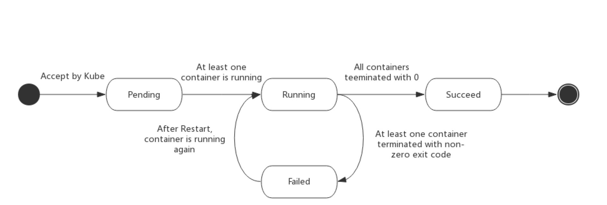

###### 如何编写资源yaml

1. 拿来主义，从机器中已有的资源中拿

   ```bash
   $ kubectl -n kube-system get po,deployment,ds
   
   
   ```

2. 学会在官网查找， https://kubernetes.io/docs/home/ 

3. 从kubernetes-api文档中查找， https://kubernetes.io/docs/reference/generated/kubernetes-api/v1.16/#pod-v1-core 

4. kubectl explain 查看具体字段含义


###### pod状态与生命周期

Pod的状态如下表所示：

| 状态值               | 描述                                                         |
| -------------------- | ------------------------------------------------------------ |
| Pending              | API Server已经创建该Pod，等待调度器调度                      |
| ContainerCreating    | 拉取镜像启动容器中                                           |
| Running              | Pod内容器均已创建，且至少有一个容器处于运行状态、正在启动状态或正在重启状态 |
| Succeeded\|Completed | Pod内所有容器均已成功执行退出，且不再重启                    |
| Failed\|Error        | Pod内所有容器均已退出，但至少有一个容器退出为失败状态        |
| CrashLoopBackOff     | Pod内有容器启动失败，比如配置文件丢失导致主进程启动失败      |
| Unknown              | 由于某种原因无法获取该Pod的状态，可能由于网络通信不畅导致    |

生命周期示意图：



启动和关闭示意：


初始化容器：

- 验证业务应用依赖的组件是否均已启动
- 修改目录的权限
- 调整系统参数

```yaml
...
      initContainers:
      - command:
        - /sbin/sysctl
        - -w
        - vm.max_map_count=262144
        image: alpine:3.6
        imagePullPolicy: IfNotPresent
        name: elasticsearch-logging-init
        resources: {}
        securityContext:
          privileged: true
      - name: fix-permissions
        image: alpine:3.6
        command: ["sh", "-c", "chown -R 1000:1000 /usr/share/elasticsearch/data"]
        securityContext:
          privileged: true
        volumeMounts:
        - name: elasticsearch-logging
          mountPath: /usr/share/elasticsearch/data
...

```


验证Pod生命周期：

```yaml
apiVersion: v1
kind: Pod
metadata:
  name: pod-lifecycle
  namespace: luffy
  labels:
    component: pod-lifecycless
spec:
  initContainers:
  - name: init
    image: busybox
    command: ['sh', '-c', 'echo $(date +%s): INIT >> /loap/timing']
    volumeMounts:
    - mountPath: /loap
      name: timing
  containers:
  - name: main
    image: busybox
    command: ['sh', '-c', 'echo $(date +%s): START >> /loap/timing;
sleep 10; echo $(date +%s): END >> /loap/timing;']
    volumeMounts:
    - mountPath: /loap 
      name: timing
    livenessProbe:
      exec:
        command: ['sh', '-c', 'echo $(date +%s): LIVENESS >> /loap/timing']
    readinessProbe:
      exec:
        command: ['sh', '-c', 'echo $(date +%s): READINESS >> /loap/timing']
    lifecycle:
      postStart:
        exec:
          command: ['sh', '-c', 'echo $(date +%s): POST-START >> /loap/timing']
      preStop:
        exec:
          command: ['sh', '-c', 'echo $(date +%s): PRE-STOP >> /loap/timing']
  volumes:
  - name: timing
    hostPath:
      path: /tmp/loap


```

创建pod测试：

```bash
$ kubectl create -f pod-lifecycle.yaml

## 查看demo状态
$ kubectl -n luffy get po -o wide -w

## 查看调度节点的/tmp/loap/timing
$ cat /tmp/loap/timing
1585424708: INIT
1585424746: START
1585424746: POST-START
1585424754: READINESS
1585424756: LIVENESS
1585424756: END


```

>  须主动杀掉 Pod 才会触发 `pre-stop hook`，如果是 Pod 自己 Down 掉，则不会执行 `pre-stop hook` ,且杀掉Pod进程前，进程必须是正常运行状态，否则不会执行pre-stop钩子

